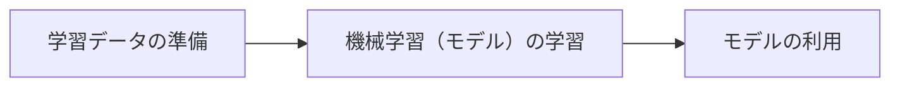
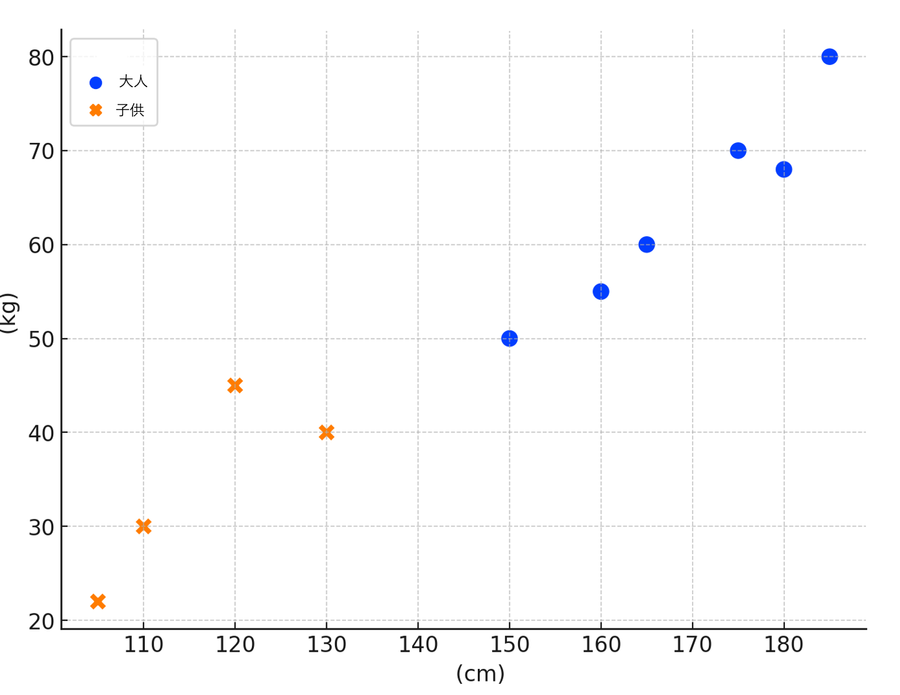
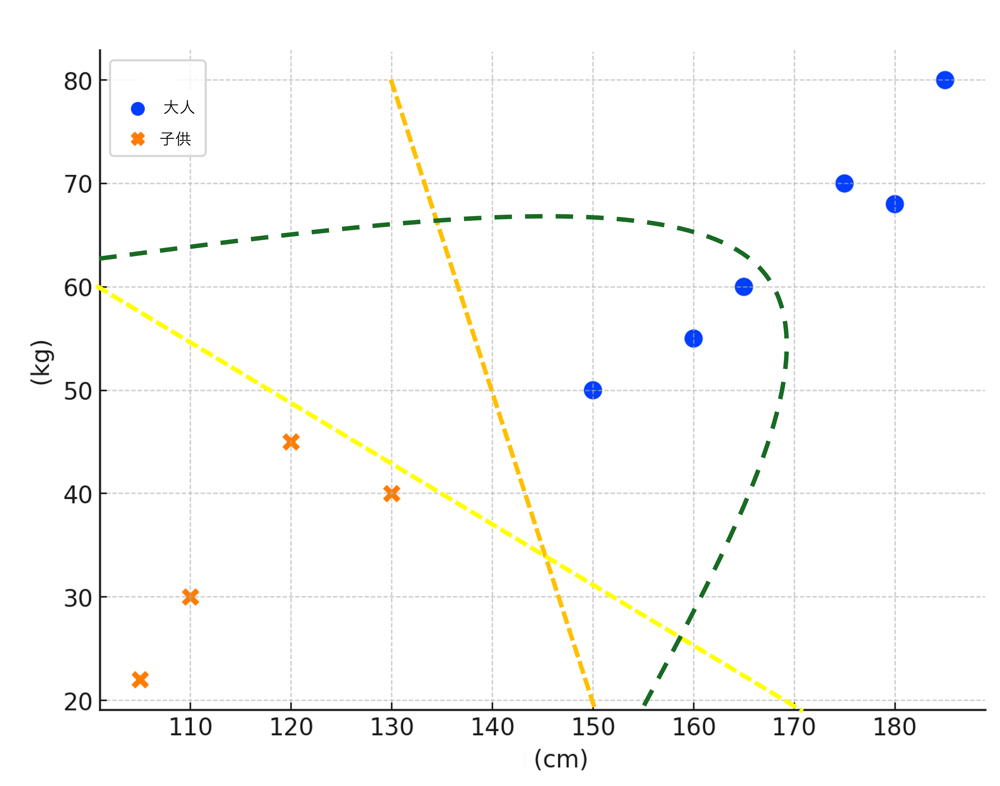

# AI基礎
### 目次
[TOC]

---

## １限目: AI基礎

## 1. イントロダクション (10分)

### 1-1. 自己紹介

#### 講師陣

```
名前: 小島 弘誉(こじま ひろたか)
専門分野: ソフトウェア工学
略歴: 
  通信事業会社にて6年、OpenStackを用いたパブリッククラウド(仮想サーバ)の開発・運用等を経験。
  本業以外でもグループ全体のアプリコンテストに出場し、UX賞、最優秀賞を受賞。  
  自動車部品メーカーにて3年、XP(Extreme Programming)を用いた新規事業(アプリ、プラットフォーム)開発を経験。   
  2021年12月より、日本の大企業で仮説検証を爆速に回せるか?の解を探して、現職。Solution Architectとして顧客が抱えている課題を解決するために日々、仮説検証を回す日々を奮闘中。     
```

```
名前: 伊藤　尚祐(いとう なおすけ)
専門分野: 情報通信
略歴:
  大学卒業後、総合電機メーカーにて通信装置の研究開発に従事。その後、スタートアップにてIoTサービスの構築をリードした後、2022年より現職。
  現在、デザイン・シンキング等で出たアイデアを短期間で実装し、ユーザー価値・ビジネス価値の最大化に挑戦中。趣味はマリオカート（仮）。
```

#### 学生の皆さん

- 名前: 
- 趣味: 
- 知りたいこと: 

### 1-2. 目標と概要

#### コース概要

このコースは人工知能（AI）の基本的な理論とその活用についての理解を提供することを目的とします。 具体的には、AIの基礎概念、倫理的考慮事項、そしてAI技術を使用して調査やドキュメント、アプリケーションを作成する実践的な方法を学びます。 このコースを通じて、AI技術の効果的かつ倫理的な使用に必要な知識とスキルを習得し、将来のキャリアや創作活動への適用につなげることができます。    

| 回数     | 1          | 2              | 3                                                 | 4                                                           | 5                                      | 6                                      | 7          | 8-14                                 |
| -------- | :--------: | :------------: | :-----------------------------------------------: | :---------------------------------------------------------: | :------------------------------------: | :------------------------------------: | :--------: | :------------------------------------: |
| テーマ   | AI基礎     | AIの活用と倫理 | プロンプトエンジニアリング:インプット(要約・翻訳) | プロンプトエンジニアリング:アウトプット(ドキュメント生成等) | プロンプトエンジニアリング:アプリ生成① | プロンプトエンジニアリング:アプリ生成② | 総合演習   | フィジカルコンピューティング |
| 担当講師 | 小島、伊藤 | 小島           | 小島                                              | 小島                                                        | 伊藤                                   | 伊藤                                   | 伊藤、小島 | 白石先生                               |


## 2. アイスブレーク (15分) 

### AIってなんでしょう? AIでどんなことができるでしょうか? ★Let's Try!!!!

早速ですが、みなさんが知っているAIについて教えてください。  
自分の考えていることをslackのチャネルに書いてみましょう。  

自分が想像するAIをイメージでき、slackへの投稿が終わった人は以下のリンクにアクセスしてみてください。  
私が学生時代にAIと聞いて、想像したであろうAIと、AIに尋ねてみた結果を以下のページに書いてみました。  

[想像するAI](./imagine_ai.md)

## 3. AIの定義と歴史 (30分)

AIは発展途上であり、歴史とともに人が想像するAIと現実のAIは変わってきています。  
AIの定義とAIがどのような歴史をたどってきたのかみてみましょう。  
現在、最も注目を浴びている大規模言語モデルを用いたAI(通称: 生成AI)は目まぐるしい勢いで進化しています。  
まさに今、歴史が大きく変わっている瞬間です。  

### 3-1. AIの定義 (10分)

人工知能（Artificial Intelligence, AI）は、人間の知的行動をコンピューターで模倣する技術、またはその研究分野を指します。  
この定義には、学習、推論、問題解決、知覚、言語理解など、人間の認知能力を再現しようとする試みが含まれます。
AIの定義は様々な文献で異なる場合がありますが、一般にはこのように広範な知的活動をコンピュータ上で実現しようとする試みとされます。  

この定義は、ジョン・マッカーシーらが1956年に提唱したものが基礎となっています。マッカーシーは、“AIは機械に知性を実装する科学および工学である”と記述しました。これは、ダートマス会議（1956年）の提案書で初めて用いられ、AI研究の出発点とされています。  

### 3-2. AIの歴史 (10分) 


AIの歴史は、1950年代の初頭にまで遡ります。英国の数学者アラン・チューリングは、「機械は考えることができるか？」という問いを提起し、チューリングテストとして知られる考え方を提案しました。これは、人間が機械との対話からその相手が機械か人間かを判別できない場合、その機械は「知的」と見なすことができるというものです。  

1956年のダートマス会議では、ジョン・マッカーシー、マービン・ミンスキー、アレン・ニューウェル、ハーバート・サイモンらが集まり、“Artificial Intelligence”という用語を初めて公式に使用しました。これは、人間の知能を模倣することにより、機械がどのように学習し、問題を解決し、自己改善するかを探求する研究の始まりを意味します。  

その後、AI研究は「冬の時代」を経験するも、1980年代にエキスパートシステムが商業的に成功し、再び注目を集めます。1990年代にはインターネットの普及と共に大量のデータが利用可能となり、2000年代に入ると、データ駆動型アプローチである機械学習が主流となりました。特に、2012年のイメージネットコンペティションでのディープラーニングの成功は、AI研究における大きな転換点となり、以降、AIは急速に発展してきました。  

AIの歴史は、技術の進化、社会のニーズ、そして計算機科学の理論の発展と密接に関連しています。今日、AIは医療、金融、自動運転車、エンターテイメントなど、あらゆる分野に影響を与え、人類の生活を根本的に変えるポテンシャルを持っています。  

### 3-3. AIの発展と現在における重要性 (10分)

#### AIの発展の概要
AI（人工知能）の発展は、初期の理論研究から現代の高度な応用まで、複数の段階を経てきました。初めはシンプルなアルゴリズムと基本的な計算モデルに焦点を当てていましたが、時間が経過するにつれ、以下の要素により大幅な進化を遂げました。  

- **機械学習とディープラーニングの進化：** 大量のデータから自動で学習し、高度な予測や認識を行う能力が開発されました。  
- **計算能力の飛躍的向上：** クラウドコンピューティングと高性能プロセッサの登場により、複雑なAIモデルの訓練が実現可能になりました。  
- **ビッグデータの利用：** デジタルデータの爆発的増加がAIの訓練と精度向上に寄与しています。  

#### 現在におけるAIの重要性
AIは、現代社会の様々な面で中心的な役割を担っています。これは以下のような幅広い応用と、それに伴う経済的および社会的影響によります。  

- **自動化と生産性の向上：** AIは労働集約的な作業の自動化を可能にし、産業全体での生産性向上に貢献しています。  
- **意思決定支援：** データドリブンなアプローチにより、企業や組織はより精度の高い予測と効率的な意思決定が可能になりました。  
- **イノベーションと新サービス：** AIは新しいビジネスモデルの創出やパーソナライズされたサービス提供を加速しています。  
- **社会課題への取り組み：** 環境保護、医療、教育など、多くの分野でAIは解決策の開発に貢献しており、持続可能な未来に向けた重要な鍵となっています。  

AIの技術は日々進化を続けており、その発展と現在における重要性は、未来の社会構造や産業の形を大きく変える可能性を秘めています。技術的な挑戦と倫理的な課題の両面において、その進化を適切に管理し、活用することが求められています。  

### 3-4. AIに質問してみよう! ★Let's Activity!!

①: [ChatGPT3.5](https://chat.openai.com/) にアクセスしよう。  
②: Sign upをクリックし、Googleアカウントでログインしよう。 (Googleで続けるをクリック)   
③: ChatGPTに説明を簡単にしてもらおう。  

```
以下の文章を小学生でもわかるように説明してください。
"""
AIの歴史は、1950年代の初頭にまで遡ります。英国の数学者アラン・チューリングは、「機械は考えることができるか？」という問いを提起し、チューリングテストとして知られる考え方を提案しました。これは、人間が機械との対話からその相手が機械か人間かを判別できない場合、その機械は「知的」と見なすことができるというものです。  

1956年のダートマス会議では、ジョン・マッカーシー、マービン・ミンスキー、アレン・ニューウェル、ハーバート・サイモンらが集まり、“Artificial Intelligence”という用語を初めて公式に使用しました。これは、人間の知能を模倣することにより、機械がどのように学習し、問題を解決し、自己改善するかを探求する研究の始まりを意味します。  

その後、AI研究は「冬の時代」を経験するも、1980年代にエキスパートシステムが商業的に成功し、再び注目を集めます。1990年代にはインターネットの普及と共に大量のデータが利用可能となり、2000年代に入ると、データ駆動型アプローチである機械学習が主流となりました。特に、2012年のイメージネットコンペティションでのディープラーニングの成功は、AI研究における大きな転換点となり、以降、AIは急速に発展してきました。  

AIの歴史は、技術の進化、社会のニーズ、そして計算機科学の理論の発展と密接に関連しています。今日、AIは医療、金融、自動運転車、エンターテイメントなど、あらゆる分野に影響を与え、人類の生活を根本的に変えるポテンシャルを持っています。  
"""
```

③: 自分のわからないところを聞いてみよう。
```
(例): 冬の時代とはなんですか?
```

### 3-5. 現在、注目されているAI

近年、人工知能（AI）技術が飛躍的に進化しています。特に、生成AI（Generative AI）と呼ばれる分野が大きな注目を集めています。では、この生成AIとは一体何なのでしょうか？また、私たちの生活にどのような変化をもたらす可能性があるのでしょうか？生成AIについて簡単に説明していきます。  

### 生成AIとは？

生成AIは、人間のように新しいコンテンツを「生成」することができるAI技術のことを指します。たとえば、テキスト、画像、音楽、ビデオなど、様々な種類のデータを自動で作り出すことができます。生成AIは大量のデータを学習し、そのデータからパターンや規則を把握することで、全く新しいコンテンツを生み出します。  

### 生成AIができること

1. **テキスト生成**: 記事や物語、詩を自動で書くことができます。例えば、あるテーマについて短い説明を入力するだけで、それを元にした完全な物語や記事を生成することが可能です。  
2. **画像生成**: ある記述に基づいて画像を生成することができます。例えば、「夕日が美しい海辺の風景」といった具体的な指示を出すことにより、AIがそのシーンを想像して画像を作り出します。  
3. **音楽生成**: 既存の楽曲のスタイルを模倣して、新しい楽曲を作り出すことが可能です。ジャンルや雰囲気を指定することで、オリジナルの音楽を生成することができます。  
4. **言語翻訳**: 高度に発展した生成AIは、自然言語処理を利用して、高品質な言語翻訳を提供します。これにより、異なる言語間でのコミュニケーションがよりスムーズになります。  
5. **データ解析と予測**: 大量のデータを分析し、将来のトレンドやパターンを予測することができます。これは、ビジネスの意思決定や科学研究において非常に有用です。  

## 4. AIの基礎概念 (50分)

### AIに質問してみよう!  ★Let's Try!!

```
日本の総理大臣を教えてください。
```

```
京都芸術大学の学長は誰ですか?
```

#### 導入：大規模言語モデルとAI技術の関連性 (10分)

- **大規模言語モデルとは：** 大量のテキストデータから学習し、人間のように自然言語を理解し生成するAI技術。GPTやGeminiなどが有名。  

- **技術の基盤：** これらのモデルはディープラーニング、特にディープラーニングの一種であるトランスフォーマーモデルに基づいています。これは、機械学習（ML）とディープラーニング（DL）の進化の最前線を示すものです。  

  

#### 1. 機械学習（ML）とは？ (20分)

- **機械学習の基本：** コンピュータがデータから学習し、タスクを改善する技術。大規模言語モデルの学習プロセスにも応用される。  
- **学習方法の紹介：** 教師あり学習、教師なし学習、強化学習。これらの概念は、大規模言語モデルを理解するための基礎となる。  



#### 機械学習の例: 大人・子供を判定するモデル

以下の表に、体重、身長、分類（大人、子供）のサンプルデータ10個を示します。  

| 体重(kg) | 身長(cm) | 分類 |
| -------- | -------- | ---- |
| 70       | 175      | 大人 |
| 55       | 160      | 大人 |
| 45       | 120      | 子供 |
| 50       | 150      | 大人 |
| 68       | 180      | 大人 |
| 30       | 110      | 子供 |
| 22       | 105      | 子供 |
| 80       | 185      | 大人 |
| 60       | 165      | 大人 |
| 40       | 130      | 子供 |

散布図で示すと以下の通りなります。  



子どもと大人を分類するにはどうしたらいいでしょうか。  
オレンジの破線のように分けたら正しく分類できそうですね。    
いや、ちょっとまってください。
我々は経験的に身長が高い人ほど、体重が重くなる可能性が高いことを知っています。となるとオレンジの破線は間違っていそうです。

```
w1(重み1) * x(身長) + w2(重み2) * y(体重) < 190
```





#### 2. ディープラーニング（DL）とその他のAI技術 (10分)

次に機械学習の一つ手法であるディープラーニングについて説明します。  
ディープラーニングは多層ニューラルネットワークを使用した学習方法であり、大規模言語モデルの背後にある主要な技術になります。  
尚、ニューラルネットワークは、人間の脳を模倣した計算モデルの一種でディープラーニングの基礎を成す技術です。脳のニューロンが相互に接続されて複雑なタスクを処理するように、ニューラルネットワークも「ノード」または「ニューロン」と呼ばれる基本的な計算単位が相互に接続されています。これらの接続は、入力データからパターンを学習し、予測や分類などのタスクを実行するために使用されます。  


ディープラーニングを用いた数字を認識する例は[こちら](https://www.youtube.com/watch?v=6M5VXKLf4D4)。


#### 3. ルールベースのシステムとその限界 (10分)

- **ルールベースシステムとは：** 明確なルールや手続きに基づいて意思決定を行うシステムです。伝統的なプログラミングの一形態で、特定の入力に対して予定された出力を提供します。  
- **利点と限界：** ルールベースシステムはその透明性と解釈可能性で知られていますが、複雑な問題や未知の状況に適応する能力には限界があります。このため、機械学習やディープラーニングのようなデータ駆動型アプローチが注目されるようになりました。  
- **応用例と進化：** 初期のエキスパートシステムや決定支援システムはルールベースのアプローチを採用していましたが、現在ではより複雑でダイナミックな問題を解決するために、機械学習やディープラーニングが組み込まれることが増えています。  

### 演習

今までのChatGPTを使ったみんなに共有してみましょう。

---

## 2限目: AIワークショップとまとめ

## 1-1. AIワークショップ (80分)


## 1-2. まとめと次回予告 (20分)

### 本日の講義の要点の復習  

- 歴史に基づき、AI(人工知能)とは何か考察
- 現在、最も注目されている生成AIを理解　※どんどん使おう!!
- ワークショップを通して、自分たちのAIへの考えを整理

### 次回講義のテーマについて

- AIで働き方がどう変わると予想されているか

- AIを使う際に気をつけるべきこととは?

- 

  

## 3. 参考情報

### 参考サービス

- ChatGPT4
- Gemini

### 参考文献

- [imidas: ダートマス会議](https://imidas.jp/genre/detail/K-102-0113.html)
- [大規模言語モデルは新たな知能か](https://www.amazon.co.jp/%E5%A4%A7%E8%A6%8F%E6%A8%A1%E8%A8%80%E8%AA%9E%E3%83%A2%E3%83%87%E3%83%AB%E3%81%AF%E6%96%B0%E3%81%9F%E3%81%AA%E7%9F%A5%E8%83%BD%E3%81%8B%E2%80%95%E2%80%95ChatGPT%E3%81%8C%E5%A4%89%E3%81%88%E3%81%9F%E4%B8%96%E7%95%8C-%E5%B2%A9%E6%B3%A2%E7%A7%91%E5%AD%A6%E3%83%A9%E3%82%A4%E3%83%96%E3%83%A9%E3%83%AA%E3%83%BC-%E5%B2%A1%E9%87%8E%E5%8E%9F-%E5%A4%A7%E8%BC%94/dp/4000297198/ref=asc_df_4000297198/?tag=jpgo-22&linkCode=df0&hvadid=654954019163&hvpos=&hvnetw=g&hvrand=5543730617596746961&hvpone=&hvptwo=&hvqmt=&hvdev=c&hvdvcmdl=&hvlocint=&hvlocphy=1009461&hvtargid=pla-2198066508387&psc=1&mcid=69198d2972333467974f3f3cbf416e48&th=1&psc=1&gad_source=1)
- [教養としての生成AI](https://www.amazon.co.jp/-/en/%E6%B8%85%E6%B0%B4%E4%BA%AE-ebook/dp/B0CBLMWP91/ref=sr_1_32?crid=1212HENXZ5V&dib=eyJ2IjoiMSJ9.oqQPTYZpJ4c5utCMyR4AKqHFMYmNuEPzkEt_pnIzjN8sIueUPCHpB6qWJB0-8YTklyn_EPi0sVi6jX5MozNq8l753L4wYgmGzvC1JTRZE9Z6NlmodVSS-WCUpNAF3733-B3Av95pJmjURjuzyLLtYcc4uqSZDfBBLuu6Ko_DOwy3uH4rZrFt-j8RT1_dZd0MMwdXuDpV-AbxOOMiuK6vjn1cykS7q9iSaY4yyjL0oUeFPJ4dxaqFMRPG21ZNKoHJkRdq8C1m-6zEtjYN01Ql-h4R34SrHzoQA0F2o9taGR0.jdd0eL7BCXMTJ-cFPpyJcvGu5NW6wgbcTXBUmpw_qrE&dib_tag=se&keywords=%E7%94%9F%E6%88%90ai&qid=1712839430&sprefix=%E7%94%9F%E6%88%90ai+%2Caps%2C163&sr=8-32)

### 参考動画

- [「生成AI」(3) 松尾豊・東京大学大学院教授　2024.3.15](https://www.youtube.com/watch?v=U9vhGvFxKu0&t=8s)
- [はじめてのAI](https://ibm-learning.udemy.com/course/google-jp-ai/learn/lecture/14263088?start=83#overview)
