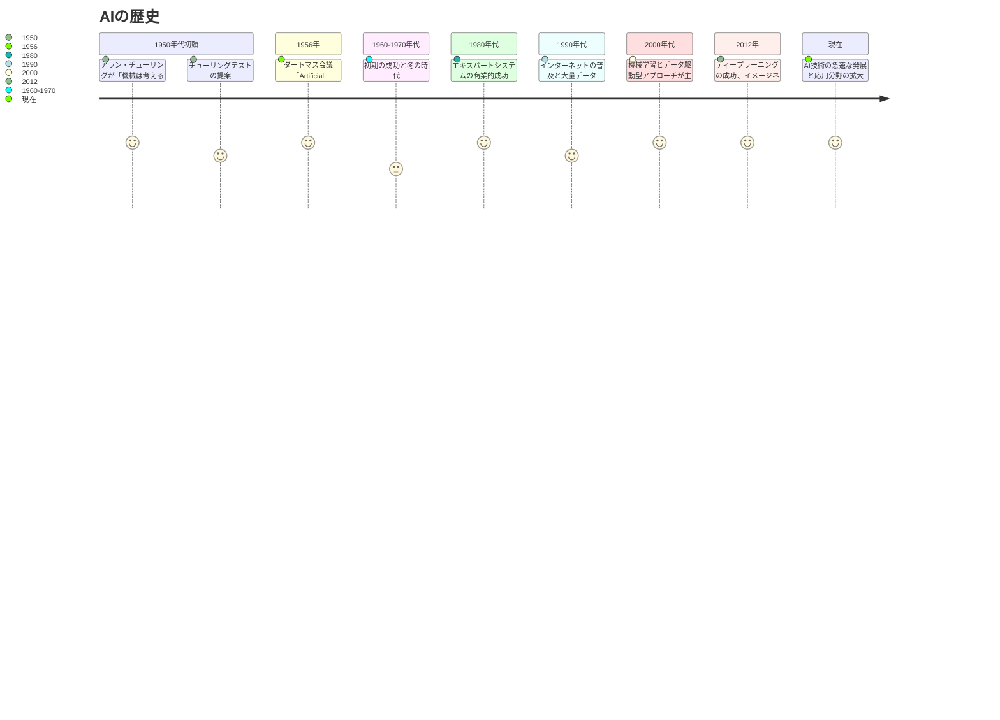

# AI基礎
### 目次
[TOC]

---

## １限目: AI基礎

## 1. イントロダクション (10分)

### 1-1. 自己紹介

- 名前：
- 背景：
- 専門分野：

- 名前：
- 背景：
- 専門分野：

### 1-2. 目標と概要

#### コース概要

このコースは人工知能（AI）の基本的な理論とその活用についての理解を提供することを目的とします。 具体的には、AIの基礎概念、倫理的考慮事項、そしてAI技術を使用して調査やドキュメント、アプリケーションを作成する実践的な方法を学びます。 このコースを通じて、AI技術の効果的かつ倫理的な使用に必要な知識とスキルを習得し、将来のキャリアや創作活動への適用につなげることができます。

#### 学習目標

学生は、AIの原理を深く理解し、主要な概念を簡明に説明できる。 また、AIの倫理的、社会的側面についての知識を有し、技術使用のリスクと利益を論理的に評価する能力を持つ。 さらに、AI技術を使いこなし、調査やドキュメント作成、アプリケーション開発に応用できる。 

#### 到達目標

学生は、AIの基本原理に関して基本的な理解を有し、簡単な概念を説明できる。 また、AIの倫理的、社会的側面について基礎知識を持ち、簡潔な事例を用いて意見を述べることができる。 さらに、AI技術を利用した基本的な調査やドキュメント作成の初歩を理解し、基礎的なアプリケーション開発に適用できる 

#### 注意事項

- 講義中には、実際のAIアプリケーションのデモンストレーションや、簡単な演習を取り入れる予定です。ノートPCやスマートフォンの準備をお願いします。

## 2. アイスブレーク (15分)

### AIってなんでしょう? AIでどんなことができるでしょうか? ☆Let's Activity!!

早速ですが、みなさんが知っているAIについて教えてください。
自分の考えていることをslackのチャネルに書いてみましょう。

自分が想像するAIをイメージでき、slackへの投稿が終わった人は以下のリンクにアクセスしてみてください。
私が学生時代にAIと聞いて、想像したであろうAIと、AIに尋ねてみたAIについて以下のページに書いてみました。

[想像するAI](./imagine_ai.md)

## 3. AIの定義と歴史 (30分)

AIは発展途上であり、歴史とともに人が想像するAIと現実のAIは変わってきています。
AIの定義とAIがどのような歴史をたどってきたのかみてみましょう。
現在、最も注目を浴びている大規模言語モデルを用いたAI(通称: 生成AI)は目まぐるしい勢いで進化しています。
まさに歴史が変わっている瞬間です。

### 3-1. AIの定義 (10分)

人工知能（Artificial Intelligence, AI）は、人間の知的行動をコンピューターで模倣する技術、またはその研究分野を指します。
この定義には、学習、推論、問題解決、知覚、言語理解など、人間の認知能力を再現しようとする試みが含まれます。
AIの定義は様々な文献で異なる場合がありますが、一般にはこのように広範な知的活動をコンピュータ上で実現しようとする試みとされます。

この定義は、ジョン・マッカーシーらが1956年に提唱したものが基礎となっています。マッカーシーは、“AIは機械に知性を実装する科学および工学である”と記述しました。これは、ダートマス会議（1956年）の提案書で初めて用いられ、AI研究の出発点とされています。

### 3-2. AIの歴史 (10分) ※後ほど改善

AIの歴史は、1950年代の初頭にまで遡ります。英国の数学者アラン・チューリングは、「機械は考えることができるか？」という問いを提起し、チューリングテストとして知られる考え方を提案しました。これは、人間が機械との対話からその相手が機械か人間かを判別できない場合、その機械は「知的」と見なすことができるというものです。

1956年のダートマス会議では、ジョン・マッカーシー、マービン・ミンスキー、アレン・ニューウェル、ハーバート・サイモンらが集まり、“Artificial Intelligence”という用語を初めて公式に使用しました。これは、人間の知能を模倣することにより、機械がどのように学習し、問題を解決し、自己改善するかを探求する研究の始まりを意味します。

その後、AI研究は「冬の時代」を経験するも、1980年代にエキスパートシステムが商業的に成功し、再び注目を集めます。1990年代にはインターネットの普及と共に大量のデータが利用可能となり、2000年代に入ると、データ駆動型アプローチである機械学習が主流となりました。特に、2012年のイメージネットコンペティションでのディープラーニングの成功は、AI研究における大きな転換点となり、以降、AIは急速に発展してきました。

AIの歴史は、技術の進化、社会のニーズ、そして計算機科学の理論の発展と密接に関連しています。今日、AIは医療、金融、自動運転車、エンターテイメントなど、あらゆる分野に影響を与え、人類の生活を根本的に変えるポテンシャルを持っています。

### 3-3. AIの発展と現在における重要性 (10分)

#### AIの発展の概要
AI（人工知能）の発展は、初期の理論研究から現代の高度な応用まで、複数の段階を経てきました。初めはシンプルなアルゴリズムと基本的な計算モデルに焦点を当てていましたが、時間が経過するにつれ、以下の要素により大幅な進化を遂げました。

- **機械学習とディープラーニングの進化：** 大量のデータから自動で学習し、高度な予測や認識を行う能力が開発されました。
- **計算能力の飛躍的向上：** クラウドコンピューティングと高性能プロセッサの登場により、複雑なAIモデルの訓練が実現可能になりました。
- **ビッグデータの利用：** デジタルデータの爆発的増加がAIの訓練と精度向上に寄与しています。

#### 現在におけるAIの重要性
AIは、現代社会の様々な面で中心的な役割を担っています。これは以下のような幅広い応用と、それに伴う経済的および社会的影響によります。

- **自動化と生産性の向上：** AIは労働集約的な作業の自動化を可能にし、産業全体での生産性向上に貢献しています。
- **意思決定支援：** データドリブンなアプローチにより、企業や組織はより精度の高い予測と効率的な意思決定が可能になりました。
- **イノベーションと新サービス：** AIは新しいビジネスモデルの創出やパーソナライズされたサービス提供を加速しています。
- **社会課題への取り組み：** 環境保護、医療、教育など、多くの分野でAIは解決策の開発に貢献しており、持続可能な未来に向けた重要な鍵となっています。

AIの技術は日々進化を続けており、その発展と現在における重要性は、未来の社会構造や産業の形を大きく変える可能性を秘めています。技術的な挑戦と倫理的な課題の両面において、その進化を適切に管理し、活用することが求められています。

## 4. AIの基礎概念 (50分)

#### 導入：大規模言語モデルとAI技術の関連性 (10分)

- **大規模言語モデルとは：** 大量のテキストデータから学習し、人間のように自然言語を理解し生成するAI技術。GPTやBERTなどが有名。
- **技術の基盤：** これらのモデルはディープラーニング、特にディープラーニングの一種であるトランスフォーマーモデルに基づいています。これは、機械学習（ML）とディープラーニング（DL）の進化の最前線を示すものです。

#### 1. 機械学習（ML）とは？ (20分)

- **機械学習の基本：** コンピュータがデータから学習し、タスクを改善する技術。大規模言語モデルの学習プロセスにも応用される。
- **学習方法の紹介：** 教師あり学習、教師なし学習、強化学習。これらの概念は、大規模言語モデルを理解するための基礎となる。

#### 2. ディープラーニング（DL）とその他のAI技術 (10分)

- **ディープラーニングの概要：** 多層ニューラルネットワークを使用した学習方法。大規模言語モデルの背後にある主要な技術。
- **トランスフォーマーモデル：** 自己注意機構を利用して、文脈を理解する能力を持つ。言語モデルの進化において重要な役割を果たす。
- **その他のAI技術との関連性：** 自然言語処理（NLP）やコンピュータビジョンなど、ディープラーニングは幅広いAI応用分野の基盤技術となっている。

#### 3. ルールベースのシステムとその限界 (10分)

- **ルールベースシステムとは：** 明確なルールや手続きに基づいて意思決定を行うシステムです。伝統的なプログラミングの一形態で、特定の入力に対して予定された出力を提供します。
- **利点と限界：** ルールベースシステムはその透明性と解釈可能性で知られていますが、複雑な問題や未知の状況に適応する能力には限界があります。このため、機械学習やディープラーニングのようなデータ駆動型アプローチが注目されるようになりました。
- **応用例と進化：** 初期のエキスパートシステムや決定支援システムはルールベースのアプローチを採用していましたが、現在ではより複雑でダイナミックな問題を解決するために、機械学習やディープラーニングが組み込まれることが増えています。

## 5. AIの応用分野 (15分)

#### AIが活躍する主な分野 (5分)

- **医療：** AIは疾病の早期発見、診断支援、治療計画の最適化、新薬開発などに利用されています。例えば、画像診断においてAIは人間の専門家と同等またはそれ以上の精度で病変を識別することができます。
- **金融：** AI技術は、詐欺検出、クレジットスコアリング、アルゴリズムトレーディング、顧客サービスの自動化など、金融業界の様々な面で活用されています。AIによる分析は、より迅速で正確な決定を可能にします。
- **エンターテイメント：** 映画や音楽の推薦システム、ゲーム内のAIキャラクター、個人化されたコンテンツ生成など、AIはエンターテインメント産業を変革しています。これにより、ユーザー体験はよりパーソナライズされ、魅力的なものになります。

#### 実社会でのAI応用事例紹介 (5分)

- **自動運転車：** AIは車両の周囲環境を認識し、リアルタイムで安全な運転決定を行うことで、自動運転技術の核心部分を担っています。これには、コンピュータビジョン、センサーデータの融合、経路計画などが含まれます。
- **スマートホーム：** AIを搭載したスマートスピーカーや家庭用ロボットは、音声認識や自然言語処理を活用して、家庭内でのタスクを支援します。これにより、日常生活がより便利で快適になります。

#### AIの限界と課題 (5分)

- **限界：** AI技術は依然として特定のタスクや環境で最も効果的ですが、一般的な知能（汎用AI）を実現するには至っていません。また、大量のデータや計算リソースを必要とすることが多く、効率性や環境への影響も懸念されます。
- **倫理的課題：** プライバシーの侵害、偏見や不平等の増大、仕事の自動化による雇用への影響など、AIの進展は多くの倫理的問題を引き起こしています。これらの問題に対処するためには、技術的な改善だけでなく、法的規制やガイドラインの策定も必要です。

この講義では、AI技術がどのように様々な分野で活用されているか、そしてその応用がもたらす利点とともに直面している限界や課題についても考察します。AIの社会への影響を全体的に理解することで、学生は技術の進歩を倫理的な観点からも評価する能力を養うことができます。

## 6. AI技術の現在と未来 (15分)

#### 最新のAI技術トレンド (4分)

- **自然言語処理（NLP）の進化：** より洗練された大規模言語モデルが登場し、人間のように複雑なテキストを理解し生成できる能力が向上しています。
- **汎用人工知能（AGI）への取り組み：** 特定のタスクに限定されない、より汎用的な知能を持つAIの研究が進行中です。
- **AI倫理とガバナンス：** AI技術の倫理的使用を確保するための枠組みやガイドラインが重要視され始めています。
- **AIとエッジコンピューティング：** AIアルゴリズムをデバイス上で直接実行し、クラウドとの通信に頼らないエッジAIの利用が拡大しています。

#### 今後のAI技術の発展予測 (4分)

- **AIの民主化：** より簡単にアクセスでき、利用しやすいAIツールの普及により、非専門家でもAIを活用できるようになるでしょう。
- **強化学習の応用拡大：** 自律的な意思決定を行うシステムの発展に寄与し、より複雑な環境やタスクでの利用が期待されます。
- **AIと人間の協働：** AIが人間の能力を補完し、クリエイティブな作業や意思決定プロセスを支援する形での協働が増えるでしょう。
- **倫理的AIの強化：** AIの公平性、透明性、説明可能性を高める研究が進むことで、より倫理的なAIシステムが実現します。

#### 人類とAIの共存に向けた考察 (4分)

- **職業との共存：** AIによる自動化が進む中、人間独自の創造性や共感力、対人スキルが求められる職業が重要性を増します。
- **教育と再スキリング：** AI時代に求められるスキルセットに対応するための教育システムの変革や、現職者向けの再スキリングが重要になります。
- **社会的インパクト：** AIがもたらす経済的・社会的影響を考慮し、失業率の増加や格差の拡大などの問題に対処する政策が必要です。

#### 生成AIにより影響を受けると言われている職業 (3分)

- **コンテンツ制作関連職：** ライティング、デザイン、音楽制作など、AIが創造的なプロセスを支援または代替することで影響を受けます。
- **カスタマーサービス：** AIチャットボットや仮想アシスタントの進化により、カスタマーサポートの職務が変化します。
- **製造業：** AIによる自動化が進むことで、製造プロセスの効率化が進み、従来の製造業の仕事に変化が生じる可能性があります。
- **分析職：** データ分析や市場分析など、AIによる高度な分析能力が求められる職業が影響を受けることが予想されます。

---

2限目: AIワークショップとまとめ

## 7. AIワークショップ (80分)

AIに対する期待と不安
コミュニケーション活性化させ、質問しやすくする。

## 8. まとめと次回予告 (20分)

- 本日の講義の要点の復習
- 次回講義のテーマと準備についての案内

## 参考サービス

- ChatGPT4
- Gemini

## 参考文献

- [imidas: ダートマス会議](https://imidas.jp/genre/detail/K-102-0113.html)
- 
