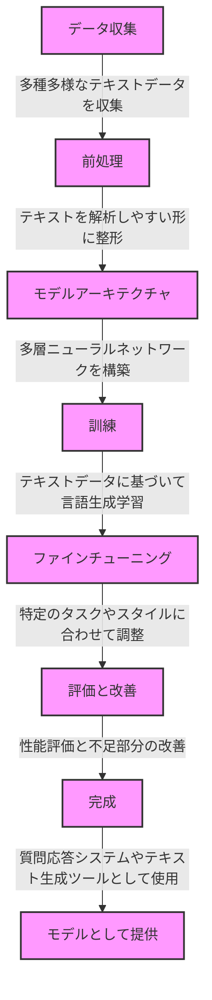

# 1限目 AI活用と倫理

## 前回の振り返り (5分)

- AIの定義と歴史
- 現代で注目される生成AIと機会学習とディープラーニングの関係
- ワークショップで出た内容の共有

## 本講義の位置付け (5分)


| 回数     |     1      |       **2**        |                         3                         |                              4                              |                   5                    |                   6                    |     7      |             8-14             |
| -------- | :--------: | :----------------: | :-----------------------------------------------: | :---------------------------------------------------------: | :------------------------------------: | :------------------------------------: | :--------: | :--------------------------: |
| テーマ   |   AI基礎   | **AIの活用と倫理** | プロンプトエンジニアリング:インプット(要約・翻訳) | プロンプトエンジニアリング:アウトプット(ドキュメント生成等) | プロンプトエンジニアリング:アプリ生成① | プロンプトエンジニアリング:アプリ生成② |  総合演習  | フィジカルコンピューティング |
| 担当講師 | 小島、伊藤 |      **小島**      |                       伊藤                        |                            小島                             |                  伊藤                  |                  小島                  | 伊藤、小島 |           白石先生           |


## 生成AIの仕組み (40分)

### 大規模言語モデルの仕組み (20分)

生成AIの大規模言語モデル、例えばOpenAIのChatGPTのようなモデルは、非常に大量のテキストデータを使用して訓練されます。その仕組みを説明します。

#### 大規模言語モデルが生成されるプロセス

##### 1. データ収集
まず、モデルを訓練するためには、多種多様なテキストデータが必要です。これには書籍、新聞記事、ウェブサイトのテキスト、対話記録などが含まれます。これらのデータはモデルに言語の多様性を教え、現実世界での言語の使用方法を模倣させるために使用されます。

##### 2. 前処理
データを収集した後、テキストを機械が理解しやすい形式に変換する必要があります。これは「前処理」と呼ばれ、テキストから不要な部分（例えば特定の記号やノイズとなる要素）を取り除き、テキストを単語やフレーズに分割する作業を含みます。

##### 3. モデルアーキテクチャ
言語モデルは通常、多数の層を持つニューラルネットワークを基盤として構築されます。
これらの層はデータから複雑なパターンや言語の構造を抽出する役割を持ちます。

##### 4. 訓練
訓練過程では、モデルに大量のテキストデータを「読ませ」、それに基づいて何が適切な返答かを予測させます。モデルは与えられたテキスト（入力）に基づいて次の単語や文を生成することを学びます。誤った予測をした場合、そのエラーから学び、次第に正確な言語生成ができるようになります。

##### 5. ファインチューニング
基本的な訓練後、特定のタスクや特定の言語スタイルに合わせてモデルをさらに調整することがあります。これにより、モデルはより特定の要求に対応できるようになります。

##### 6. 評価と改善
最後に、モデルの性能を評価し、不足している部分があればさらに訓練を続けます。
この過程は、モデルが実際の利用シナリオでうまく機能するようにするために重要です。

このようにして、大規模言語モデルは作られ、私たちが日常的に使うような質問応答システムやテキスト生成ツールへと変わっていきます。




#### 具体例

##### 具体的な例: 文「私は昨日、カフェでコーヒーを飲みました。」

穴埋め問題についての具体的な例を通じて、どのような単語が予測され、それがどのように数値変換されるかを詳しく説明します。ここでは、シンプルな文を使用してプロセス全体をステップバイステップで説明します。

##### ステップ1: トークン化と数値化
##### まず、この文をトークン化し、各トークンに一意のIDを割り当てます。このIDは、事前に定義された語彙リストに基づいています。

- **トークン化**: 「私」「は」「昨日」「、」「カフェ」「で」「コーヒー」「を」「飲み」「ました」「。」
- **数値化**: 例えば、語彙リストに基づいて各トークンに次のようなIDを割り当てるとします（数字は例示です）。
  - 私 -> (123, 23)
  - は -> (45, 45)
  - 昨日 -> (678, 78)
  - 、 -> (9, 9)
  - カフェ -> (789, 89)
  - で -> (56, 56)
  - コーヒー -> (1011,11)
  - を -> (67, 67)
  - 飲み -> (890, 90)
  - ました -> (1112, 12)
  - 。 -> (12, 12)

#### ステップ2: マスキングと予測の設定
次に、「コーヒー」という単語をマスクし、モデルにその単語を予測させます。

- **マスキングされた文**: 「私は昨日、カフェで\[MASK\]を飲みました。」

#### ステップ3: モデルによる予測
このマスクされた文はモデルに入力され、モデルは\[MASK\]の位置に来る単語の予測を試みます。予測は次のように行われます。

- **モデルの処理**: 埋め込みベクトルとして数値化されたトークンがニューラルネットワークに入力され、ネットワークは「コーヒー」という単語を予測することを目指します。
- **ソフトマックス層の出力**: モデルは\[MASK\]の位置で最も可能性の高い単語に対して確率を割り当てます。例えば、「コーヒー」が(1011, 11)、他の単語には異なる確率が割り当てられます。

#### ステップ4: 評価と学習
- **予測の評価**: モデルが正しく「コーヒー」を予測した場合、誤差は小さくなります。誤った単語を予測した場合、その誤差を用いてモデルの重みを更新し、正しい予測が出るように調整します。

このようにして、モデルは文脈から適切な単語を推測する訓練を受け、徐々に言語の理解と生成能力を向上させていきます。

### 生成AIとトークン

生成AI、特に言語モデルにおける「トークン」とは、テキストを処理しやすい単位に分割したものを指します。これらのトークンは、単一の文字、単語、あるいはその一部分（サブワード）であり得ます。具体的なトークン化の方法は使用されるモデルやその訓練目的に依存します。

モデル毎に生成AIを利用する際のインプット・アウトプット上限数が異なります。

| モデル  | インプット/アウトプット可能なトークン数 |
| ------- | --------------------------------------- |
| GPT-1   | 512                                     |
| GPT-2   | 1,024                                   |
| GPT-3.5 | ?? (演習)                               |
| PaLM    | 8,192                                   |
| GPT-4   | 25,000                                  |

### 演習: モデルの上限について知ろう

以下の2つを調べてslackに投稿しよう。

#### - ChatGPT3.5のトークン数は? 

#### - 最大トークン数を以上いれるとどうなる?

[こちらのサンプル](./token_max_sample)の文字列をコピーし、
[Tokenizer](https://platform.openai.com/tokenizer)にはりつけてトークン数を確認しましょう。

ChatGPTに要約するように依頼してみましょう。


答えはこちら。

### マルチモーダルAIと仕組み (10分)

- ベクトルーデーターベース (vector db)
- word2vec

### AIと職業に与える影響 (10分)

- 生成AI登場以前に予想されていた職業への影響
- 生成AI登場後に予想される職業への影響

## 休憩 (10分)

## AI倫理 (40分)

### AIリスクと対策

AI技術の急速な発展により、私たちの生活は多くの便利さを享受していますが、それに伴い多くのリスクも生じています。AIを利用する際に生じる潜在的なリスクとそれらに対する対策について解説します。

#### AIリスクストーリー: 新しいサービスの開発にAIを使用した場合　※まだ本事例は発生していない

#### タイトル: AIによるアイディアの流出

#### 登場人物

- **A子さん**：若くて野心的な起業家。新しいビジネスアイディアを具体化し、市場に導入しようとしている。

#### 背景

A子さんは最近、生成AIを活用して自分のビジネスアイディアを形にしていました。彼女は、AIを用いて、提案されたアイディアについてさまざまな角度から考察し、それをさらに発展させるための入力（プロンプト）を行っていました。このプロセスを通じて、A子さんは特に革新的なビジネスモデルを考え出し、その実現に向けて動き始めていました。

#### 事件の発展

ある日、A子さんはニュースで、ある大企業がまさに彼女が考えていたアイディアと非常に似た新サービスを発表したことを知ります。初めは偶然の一致かと思いましたが、そのアイディアは彼女がAIに入力したプロンプトと非常に細部まで一致していました。

#### 問題の解明

ショックを受けたA子さんは、使用していたAIサービスのプロバイダーに連絡を取り、何が起こったのかを尋ねました。調査の結果、AIサービスプロバイダーはユーザーがAIに入力したデータを、モデルの訓練データとして使用していることが判明しました。このプラクティスにより、他のユーザーも同様にAIサービスを利用していた大企業が、A子さんのアイディアに似たプロンプトを入力した結果、AIが生成したアイディアが彼女のものと酷似してしまったのです。

#### 教訓

この事件から、A子さんと他の起業家たちは、AIサービスを利用する際のリスクについて学びました。
特に、自分の創造的なアイディアや知的財産を保護するために、AIサービスの利用規約をよく理解し、どのようにデータが使用されるかを確認することの重要性が浮き彫りになりました。


- AIと関連する人を構造的に捉える
  - AI開発者 (モデル開発者)
  - AI導入者 (サービスプロバイダ)
  - AI利用者
- AIリスク
  - 著作権や肖像権を侵害するリスク
  - 有害・危険な情報を流布するリスク
  - 個人情報を出力するリスク
  - 気密情報や個人情報が保存されるリスク
  - 事実と違う情報を出力するリスク (ハルシネーション)
  - 人であると誤解してしまうリスク
  - 責任の所在が不明確なリスク
  - 根拠にならない情報に基づいた判断リスク (バイアス)
  - AIの挙動を理解・説明できないリスク
  - 精度が徐々に悪化するリスク (データドリフト)
  - AI攻撃リスク (敵対的サンプル、回避攻撃、ノイズ耐性)
  - AI学習を祖先する攻撃を受けるリスク (ポイズニング)
  - プロンプトインジェクション 
  - モデルをコピーさせるリスク (抽出攻撃)
- 演習: ChatGPTに入力されるデータはどうなるか?
  - ChatGPTに入力したデータはどうなるでしょうか。
  - ChatGPTに入力したデータ
- リスク対策
  - AI開発者がとるべき対策 ※今回は省略
  - AI利用者がとるべき対策
  - AI導入者がとるべき対策


# 2限目 AIリスク対策演習

### 演習: 自分の好きなAIサービスに関する調査・考察 (30分)

- (前回ワークショップででたアイディアをベースに)
  自分が使いたいAIサービス(画像生成、音楽生成等々)を1つ決めましょう (10分)
- そのAIサービスにはどのようなリスクがあると思いますか? (5分)
  - 書き出してみましょう
- そのサービス規約にリスクと関連する記述があるか調査してみましょう。参考にしたサイトは参考文献に書いておきましょう。(10分)
- どのような対策をこうじることができるでしょうか、考えてみましょう。(10分)


```
例:
自分が使いたいAIサービス: ChatGPT
AIサービスリスクの考察:
- 事実と違う情報を出力するリスク
- 人であると誤解してしまうリスク
- 根拠にならない情報に基づいた判断リスク (バイアス)
リスクとサービス規約の調査:

事実と違う情報を出力するリスク: サービス規約に記述あり

参考:
Open AIサービス規約: https://openai.com/policies/terms-of-use)
```

## 休憩 (10分)


## 3. 参考情報

### 参考サービス

- ChatGPT4
- Gemini

### 参考文献

- [AIリスク教本](https://www.amazon.co.jp/AI%E3%83%AA%E3%82%B9%E3%82%AF%E6%95%99%E6%9C%AC-%E6%94%BB%E3%82%81%E3%81%AE%E3%83%87%E3%82%A3%E3%83%95%E3%82%A7%E3%83%B3%E3%82%B9%E3%81%A7%E5%8D%B1%E6%A9%9F%E5%9B%9E%E9%81%BF%EF%BC%86%E3%83%93%E3%82%B8%E3%83%8D%E3%82%B9%E5%8A%A0%E9%80%9F-%E6%97%A5%E6%9C%ACIBM-AI%E5%80%AB%E7%90%86%E3%83%81%E3%83%BC%E3%83%A0/dp/4296204084)
- [大規模言語モデルは新たな知能か](https://www.amazon.co.jp/%E5%A4%A7%E8%A6%8F%E6%A8%A1%E8%A8%80%E8%AA%9E%E3%83%A2%E3%83%87%E3%83%AB%E3%81%AF%E6%96%B0%E3%81%9F%E3%81%AA%E7%9F%A5%E8%83%BD%E3%81%8B%E2%80%95%E2%80%95ChatGPT%E3%81%8C%E5%A4%89%E3%81%88%E3%81%9F%E4%B8%96%E7%95%8C-%E5%B2%A9%E6%B3%A2%E7%A7%91%E5%AD%A6%E3%83%A9%E3%82%A4%E3%83%96%E3%83%A9%E3%83%AA%E3%83%BC-%E5%B2%A1%E9%87%8E%E5%8E%9F-%E5%A4%A7%E8%BC%94/dp/4000297198/ref=asc_df_4000297198/?tag=jpgo-22&linkCode=df0&hvadid=654954019163&hvpos=&hvnetw=g&hvrand=5543730617596746961&hvpone=&hvptwo=&hvqmt=&hvdev=c&hvdvcmdl=&hvlocint=&hvlocphy=1009461&hvtargid=pla-2198066508387&psc=1&mcid=69198d2972333467974f3f3cbf416e48&th=1&psc=1&gad_source=1)
- [教養としての生成AI](https://www.amazon.co.jp/-/en/%E6%B8%85%E6%B0%B4%E4%BA%AE-ebook/dp/B0CBLMWP91/ref=sr_1_32?crid=1212HENXZ5V&dib=eyJ2IjoiMSJ9.oqQPTYZpJ4c5utCMyR4AKqHFMYmNuEPzkEt_pnIzjN8sIueUPCHpB6qWJB0-8YTklyn_EPi0sVi6jX5MozNq8l753L4wYgmGzvC1JTRZE9Z6NlmodVSS-WCUpNAF3733-B3Av95pJmjURjuzyLLtYcc4uqSZDfBBLuu6Ko_DOwy3uH4rZrFt-j8RT1_dZd0MMwdXuDpV-AbxOOMiuK6vjn1cykS7q9iSaY4yyjL0oUeFPJ4dxaqFMRPG21ZNKoHJkRdq8C1m-6zEtjYN01Ql-h4R34SrHzoQA0F2o9taGR0.jdd0eL7BCXMTJ-cFPpyJcvGu5NW6wgbcTXBUmpw_qrE&dib_tag=se&keywords=%E7%94%9F%E6%88%90ai&qid=1712839430&sprefix=%E7%94%9F%E6%88%90ai+%2Caps%2C163&sr=8-32)

### 参考動画

- [「生成AI」(3) 松尾豊・東京大学大学院教授　2024.3.15](https://www.youtube.com/watch?v=U9vhGvFxKu0&t=8s)