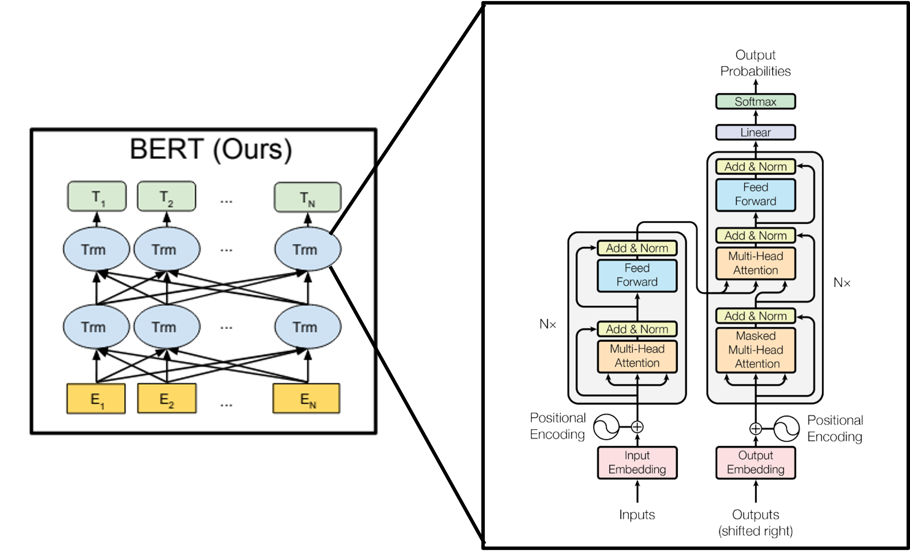
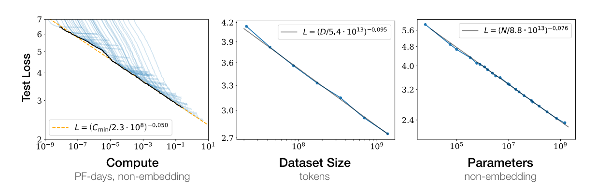
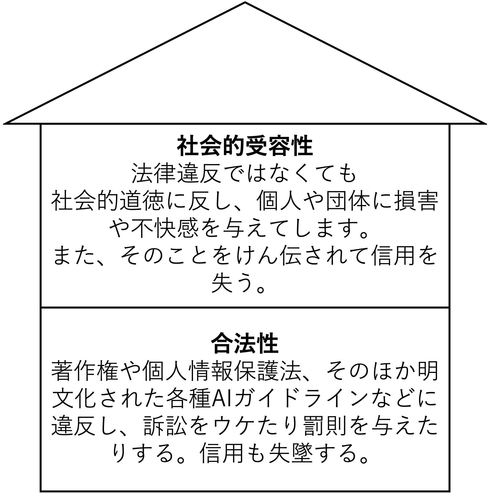
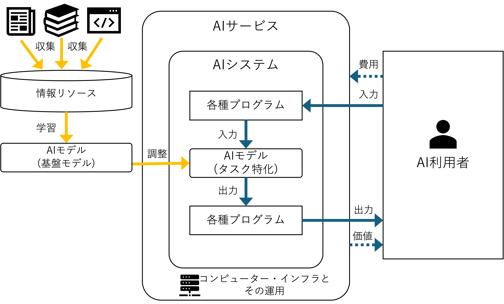
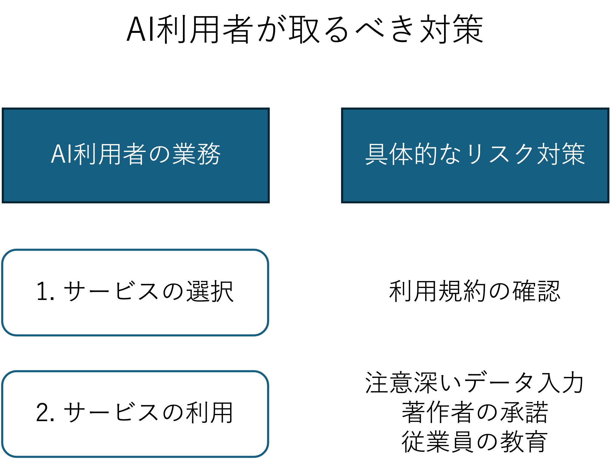
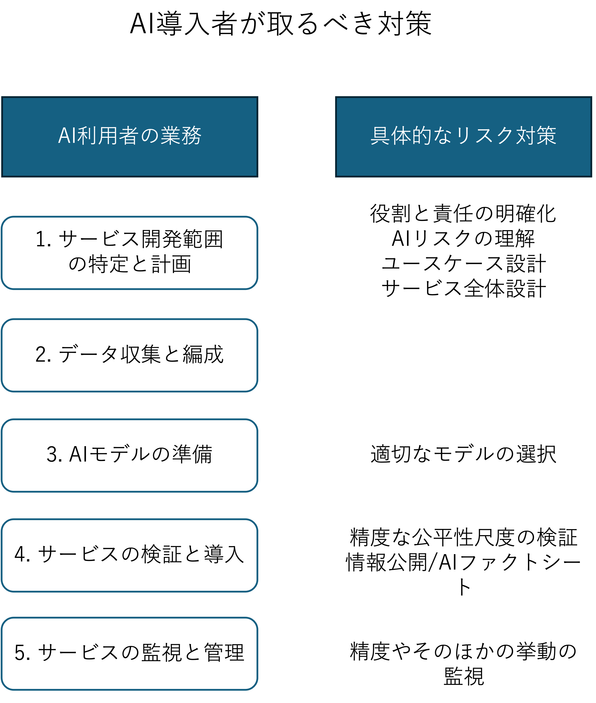

[TOC]

# AI活用と倫理

## 1. 本講義の位置付け (5分)

#### 講義の目的

この講義の主な目的は、人工知能（AI）技術の現在の応用と、それに伴う倫理的課題について深い理解を促すことです。　　
AIが社会に与える影響は計り知れず、これには多くの利益と同時に様々なリスクや倫理的問題が伴います。
AI技術使用に関連する倫理的考慮を教育することで、未来の技術者、研究者、ポリシーメーカーが責任ある判断を下すための基盤を築くことを目指します。

| 回数     |     1      |       **2**        |                         3                         |                              4                              |                   5                    |                   6                    |     7      |             8-14             |
| -------- | :--------: | :----------------: | :-----------------------------------------------: | :---------------------------------------------------------: | :------------------------------------: | :------------------------------------: | :--------: | :--------------------------: |
| テーマ   |   AI基礎   | **AIの活用と倫理** | プロンプトエンジニアリング:インプット(要約・翻訳) | プロンプトエンジニアリング:アウトプット(ドキュメント生成等) | プロンプトエンジニアリング:アプリ生成① | プロンプトエンジニアリング:アプリ生成② |  総合演習  | フィジカルコンピューティング |
| 担当講師 | 小島、伊藤 |      **小島**      |                       伊藤                        |                            小島                             |                  伊藤                  |                  小島                  | 伊藤、小島 |           白石先生           |

## 2. 前回の振り返り (10分)

- AIの定義と歴史
- 生成AIと機会学習とディープラーニングの関係
- AIワークショップ (期待、不安、やりたいこと)

AIに対する不安

```
- AIの神格化
  - AIの神格化[3]
  - 人とAIの区別がつかなくなる[2]
  - 信じすぎる[1]

- AIによる価値の転換
  - 情緒がなくなる[1]
  - 人ウケではなく、AIウケが大事になる (ex SEO) [2]
  - AIイラスト嫌みたいないざこざがうまれる[2]

- AIが職業に与える影響
  - 失業率 [4]
  - 求められる仕事が限られてくる[1]
  - 仕事がなくなる[1]
  - デザインの著作権 [1]
  - 資格制度の崩壊 [1]
  - 逆に休めなくなりそう[2]

- AIによる人に求められるスキルの転換
  - 情報格差がひろがる[2]
  - 記憶力ってどうなるんだろう[1]
  - 頭のレベルが平均になりそう[1]
  - 考えなくなる[1]
  - 考える力が低下しそう[3]

- AI利用者への被害
  - 間違った情報(AIチャット) [2]
  - 間違った情報をつかまえさせられる[1]
  - プライバシー[3]
  - プライバシー侵害[1]

- AIを用いた犯罪の発生
  - 技術悪用[3]
  - 犯罪の手引き [1]

- その他
  - カラオケ館 [2]
  
```


## 3. 生成AIと関連する重要な用語と技術 (50分)

### 3-1. 生成AIと関連する用語 (10分)

#### 生成AI (generative AI)**

- 拡散モデル（diffusion model）や大規模言語モデル（large language model; LLM）を含む、画像や自然言語を生成するモデルを指す。
- 従来の識別モデル（あるいは識別関数）に対し、生成モデルという分類があり、生成側面に焦点を当てた呼び方。

#### **基盤モデル (foundation model)**

- 自然言語や画像など、事前に学習した汎用モデルを使い、様々なタスクに適用可能。
- 主にトランスフォーマー（2017年にGoogleの研究者によって提案された手法）が使用される。
- 大規模言語モデルを含み、自然言語や画像を跨ぐマルチモーダルな応用が多い。

#### **大規模言語モデル (large language model; LLM)**

- 言語データに特化し、深層学習（主にトランスフォーマー）による自己教師あり学習で訓練された大規模なモデル。
- OpenAIのGPT-4、GoogleのPaLM、MetaのLlamaなどが有名。
- ChatGPTは、GPT-4（またはGPT-3, GPT3.5）を対話用にチューニングしたもの。

#### **拡散モデル (Diffusion model)**

- 主に画像生成AIサービスで利用されるモデル。
- 元の画像データにノイズ（Gaussian Noise）を加えるForward processと、ノイズ状態から画像データを再構築するReverse Processの２つの段階を持つ。
- Stability AIのStable DiffusionやOpenAIのDALL・E2などが有名。

### 3-2. 生成AIと関連する技術

### トランスフォーマーと自己教師あり学習 (10分)

トランスフォーマーと自己教師あり学習は、現代の生成AI(大規模言語モデル)において非常に重要な役割を果たしています。これらの技術は、言語モデルの性能を飛躍的に向上させると同時に、新しいAIモデルの開発方法論に影響を与えています。

#### トランスフォーマー

トランスフォーマーは、2017年にGoogleの研究者によって発表されたアーキテクチャで、「[Attention is All You Need](https://arxiv.org/abs/1706.03762)」という論文で紹介されました。
このモデルは従来のリカレントニューラルネットワーク（RNN）や畳み込みニューラルネットワーク（CNN）に代わるものとして設計されており、特に大量のデータを扱う際の効率性と効果性に優れています。  

トランスフォーマーの主な特徴は、自己注意機構（Self-Attention）にあります。この機構により、入力される各単語は他の全単語との関連度を計算し、それに基づいて情報を集約することができます。これにより、文中の遠く離れた要素間の関連を直接モデル化することが可能となり、文脈理解が大幅に向上します。

#### 自己教師あり学習

自己教師あり学習は、ラベルのないデータからモデルが自身で学習を進める手法です。トランスフォーマーを用いた自然言語処理では、特に事前学習と呼ばれる段階でこの手法が用いられます。事前学習では、大量のテキストデータを利用して、文の次の単語を予測する、あるいは文中の欠落した単語を埋めるといったタスクを通じて、言語の一般的なパターンや文法を学習します。

この自己教師あり学習を経て、トランスフォーマーモデルはさまざまな下流タスク（翻訳、要約、質問応答など）に適応できるようになります。この段階をファインチューニングと呼び、特定のタスクにおいてモデルを最適化します。



### 大規模言語モデルとスケール則  (5分)

スケール則（scaling laws）は、モデルのパフォーマンスがモデルサイズ、データ量、計算量といったリソースのスケールに対してどのように変化するかを定量的に記述した法則です。データ量を増やし、計算能力を強化し、モデルのパラメータ数（モデルの容量）を増加させることで、精度が向上することがわかっており、それぞれの要素が多ければ大きいほど性能があがります。例えば、GPT-3はウェブの大きなデータ（4兆単語）で事前学習。1750億パラメータ。学習に数億〜数十億円のコストです。



引用論文[“Scaling Laws for Neural Language Models”（Jared Kaplan, et al. @ OpenAI, arXiv, 2020.）](https://arxiv.org/abs/2001.08361)

### 生成AIとトークン  (5分)

生成AI、特に言語モデルにおける「トークン」とは、テキストを処理しやすい単位に分割したものを指します。これらのトークンは、単一の文字、単語、あるいはその一部分（サブワード）であり得ます。具体的なトークン化の方法は使用されるモデルやその訓練目的に依存します。

```
eg. 今日は　天気が　良いので　外に出て　散歩した　。
```


モデル毎に生成AIを利用する際のインプット・アウトプット上限数が異なります。

| モデル  | インプット/アウトプット可能なトークン数 |
| ------- | --------------------------------------- |
| GPT-1   | 512                                     |
| GPT-2   | 1,024                                   |
| GPT-3.5 | ?? (演習)                               |
| PaLM    | 8,192                                   |
| GPT-4   | 25,000                                  |

### 演習: モデルのトークン上限を知ろう (10分)

ChatGPT3.5の最大トークン数を調べてみよう。 
また、自分のトークン数を調べる方法についても調査してみよう。
その後、最大トークン数より多い文字をいれるとどうなるかやってみよう。
以下をslackに投稿しましょう。

```
ChatGPT最大トークン数: 
トークン数の調査方法: 
最大トークン数以上いれるとどうなるか?:
```

slackに投稿できたら、[回答サンプル](./token_max_sample)を確認してみましょう。

## 4. AIと職業に与える影響 (10分)

### 生成AI登場以前に予想されていた職業への影響

2013年に発表されたオクスフォード大学のカール・フレイとマイケル・オズボーンによる論文「雇用の未来：どの程度の雇用がコンピュータ化により自動化されるか？」では、多くの仕事が将来的にコンピュータやロボットによって自動化される可能性が高いという予測が示されました。この研究は、702種類の職業を対象に、それぞれの仕事が今後10年から20年の間に技術的に自動化される可能性がどの程度あるかを評価しました。

フレイとオズボーンは、特にルーティンやルールベースのタスクが自動化されやすいと指摘しています。これには、製造業の作業や事務処理作業などが含まれます。一方で、創造性、社会的相互作用、知覚と操作が必要な職業は自動化が難しいとされています。彼らはまた、教育、医療、科学技術などの専門的なスキルが要求される職業は自動化のリスクが比較的低いとも述べています。

この研究は、将来の労働市場の変化に対する警告として受け取られ、教育や職業訓練のあり方について再考を促すきっかけとなりました。また、経済的な不平等が拡大するリスクや、新たな形の雇用が出現する可能性についての議論を呼び起こす結果となりました。この論文は、テクノロジーの進展が社会や経済に与える影響を理解し、対応するための重要な基盤を提供しています。

以下、雇用の未来からの抜粋。

| 機会化の影響を受けにくい職業           | 機会化の影響を受けやすい職業 |
| -------------------------------------- | ---------------------------- |
| レクリエーションセラピスト             | 電話販売員                   |
| 整備、設置、修理の現場監督書           | 不動産の審査                 |
| 危機管理責任者                         | 手縫い仕立て屋               |
| メンタルヘルス・薬物ソーシャルワーカー | 数理技術者                   |
| 聴覚訓練士                             | 保険業者                     |
| 作業療法士                             | 時計修理工                   |
| 義肢装具士                             | 荷物取扱人                   |
| 医療ソーシャルワーカー                 | 税金申告代行                 |
| 口腔外科医                             | フィルム写真処理             |
| 消防、防災の現場監督者                 | 銀行口座の担当者             |
| 栄養士                                 | 図書館秘書の補助員           |
| 宿泊施設の支配人                       | データ入力作業員             |
| セールスエンジニア                     | 保険金星丘、契約代行         |
| 内科医・外科学                         | 証券会社の一般事務員         |
| 教育コーディネーター                   | 発注係                       |
| 心理学者                               | ローンの融資担当者           |
| 警察官・刑事の現場指揮者               | 自動車保険鑑定人             |
| 歯科医                                 | スポーツの審判               |
| 小学校教師                             | 銀行窓口                     |
| 医学者                                 | 彫刻業者                     |
| 教育管理者                             | 包装機オペレーター           |
| 足病医                                 | 調達係                       |
| 心理士                                 | 荷物の発送・受取係           |
| メンタルヘルスカウンター               | 金属加工                     |


### 生成AI登場後に予想される職業への影響


2023年にOpenAIとペンシルベニア大学が共同で発表した「GPTs are GPTs: An Early Look at the Labor Market Impact Potential of Large Language Models」という論文では、大規模言語モデル（Large Language Models、LLMs）が労働市場に及ぼす潜在的な影響について初期の洞察が提供されました。この研究では、特にLLMが特定の職業や業務にどのように影響を与え得るかを分析しています。

論文では、LLMが文書作成、データ入力、カスタマーサポートといったルーティン性の高い職務を自動化する能力があることを指摘しています。これにより、これらの業務を行う職員の仕事の性質が変化するか、または不要になる可能性が示唆されています。しかし、論文はまた、LLMが創造性や戦略的思考、高度な人間関係スキルを要求される仕事には完全には適用できないとも議論しています。

さらに、研究者たちは、LLMが新たな職業機会や業務の効率化をもたらす可能性も指摘しており、特にコンテンツ生成、言語翻訳、教育支援などの分野で新たな利用事例が生まれることが期待されています。論文は、技術の導入に伴う潜在的な経済的・社会的影響に対する政策メーカーや教育者の準備の重要性を強調しており、適応策としての教育の再設計や継続的なスキルアップデートが推奨されています。

以下、GPTs are GPTsからの抜粋。

| AIの影響を受けにくい仕事   | AIの影響を受けやすい仕事             |
| -------------------------- | ------------------------------------ |
| 農業機会操作者             | 通訳・翻訳家                         |
| アスリート                 | サーベイ研究者                       |
| 自動車ガラス取り付け修理工 | 詩人、作詞家、クリエイティブライター |
| バスとトラックの技士       | 動物科学者                           |
| セメント石工               | 広報スペシャリスト                   |
| 料理人                     | 数学者                               |
| トリマー                   | 税理士                               |
| 油田とガスのデリック操作者 | 金融分析者                           |
| 電力線の設置工と修理工     | 法務秘書                             |
| 掘削作業者                 | 公認会計士                           |
| フロア層                   | インタフェースデザイナー             |
| 鋳造方と芯棒作り           | 臨床データマネージャー               |
| 煉瓦職人                   | エンジニア                           |
| 大工                       | グラフィックデザイナー               |
| ペインター                 | 検索マーケティングストラテジー       |
| パイプレイヤー             | 投資ファンドマネージャー             |
| 屋根職人                   | 金融マネージャー                     |
| 肉、魚の切断者とトリマー   | 保険鑑定人                           |
| バイクメカニック           | 損害鑑定人                           |
| タイピング機器オペレーター | 文書取扱人                           |
| パイルドライバー           | 校正者                               |
| 金属加工                   | 気候変動アナリスト                   |


## 休憩 (10分)


## 5. AI倫理 (40分)

### 5-1. AIリスクと対策 (5分)

AI技術の急速な発展により、私たちの生活は多くの便利さを享受していますが、それに伴い多くのリスクも生じています。AIを利用する際に生じる潜在的なリスクとそれらに対する対策について解説します。

#### リスクストーリー①:  AIによるアイディアの流出


#### 登場人物

- **A子さん**：若くて野心的な起業家。新しいビジネスアイディアを具体化し、市場に導入しようとしている。

#### 背景

A子さんは最近、生成AIを活用して自分のビジネスアイディアを形にしていました。彼女は、AIを用いて、提案されたアイディアについてさまざまな角度から考察し、それをさらに発展させるための入力（プロンプト）を行っていました。このプロセスを通じて、A子さんは特に革新的なビジネスモデルを考え出し、その実現に向けて動き始めていました。

#### 事件の発展

ある日、A子さんはニュースで、ある大企業がまさに彼女が考えていたアイディアと非常に似た新サービスを発表したことを知ります。初めは偶然の一致かと思いましたが、そのアイディアは彼女がAIに入力したプロンプトと非常に細部まで一致していました。

#### 問題の解明

ショックを受けたA子さんは、使用していたAIサービスのプロバイダーに連絡を取り、何が起こったのかを尋ねました。調査の結果、AIサービスプロバイダーはユーザーがAIに入力したデータを、モデルの訓練データとして使用していることが判明しました。このプラクティスにより、他のユーザーも同様にAIサービスを利用していた大企業が、A子さんのアイディアに似たプロンプトを入力した結果、AIが生成したアイディアが彼女のものと酷似してしまったのです。

#### 教訓

この事件から、A子さんと他の起業家たちは、AIサービスを利用する際のリスクについて学びました。
特に、自分の創造的なアイディアや知的財産を保護するために、AIサービスの利用規約をよく理解し、どのようにデータが使用されるかを確認することの重要性が浮き彫りになりました。


### 5-2. AIリスクは2階建て (5分)



### 5-3. 信頼できるAIが備えるべき5つの基本特性 (10分)

- 説明可能性

  説明可能なAIは、その判断や予測の理由を人間が理解できる形で提供できるAIを指します。これにより、ユーザーはAIの行動をより良く理解し、AIの判断がもたらす影響を評価することができます。説明可能性は、AIシステムの決定に対する信頼を築くのに不可欠です。

- 公平性
  説明可能なAIは、その判断や予測の理由を人間が理解できる形で提供できるAIを指します。これにより、ユーザーはAIの行動をより良く理解し、AIの判断がもたらす影響を評価することができます。説明可能性は、AIシステムの決定に対する信頼を築くのに不可欠です。

- 透明性
  透明性は、AIシステムの設計、運用、およびその決定プロセスが開かれていることを意味します。ユーザーは、AIがどのようにしてその結果を導出したかを知ることができる必要があります。透明性は、誤解を防ぎ、より広範な監視と理解を促進します。

- 堅牢性
  堅牢なAIシステムは、予期せぬ状況やデータに対しても正確で安定した性能を発揮します。これには、様々な環境条件や操作ミスに対する耐性を含む、安全性の確保が含まれます。堅牢性は、AIシステムが信頼性高く機能し続けるために重要です。

- データ権利/プライバシーの尊重
  AIシステムは、個人のデータプライバシーを尊重し、適切なデータ保護措置を実施することが求められます。これは、データの収集、保管、利用が個人の権利を侵害しないようにするためです。プライバシーの保護は、ユーザーの信頼とAIシステムの受け入れに直接的に影響します。


### 5-4 .AIサービス構造で捉える

AIサービスを構造的に捉えることでリスクを整理しましょう。




### 5-5. AIと関連する人を整理して捉える

- AI利用者
- AI導入者 (サービスプロバイダ)
- AI開発者 (モデル開発者)






### 5-6. 演習: ChatGPTに入力されるデータはどうなるか?

ChatGPTに入力したデータはどうなるでしょうか。
以下のフォーマットを参考にSlackに投稿してみましょう。

```
(デフォルト設定の場合)ChatGPTに入力したデータはどうなるか?
```


### 5-7. AIリスクの分類

1. 著作権や肖像権を侵害するリスク [AI導入者、AI利用者]
2. 有害・危険な情報を流布するリスク [AI導入者、AI利用者]
3. AIが出力されたものへの著作権が認められなくなるリスク　[AI利用者]
4. 個人情報を出力するリスク [AI開発者、AI導入者]
5. 気密情報や個人情報が保存されるリスク [AI利用者]
6. 事実と違う情報を出力するリスク (ハルシネーション) []
7. AIを人であると誤解してしまうリスク
8. 責任の所在が不明確なリスク
9. 根拠にならない情報に基づいた判断リスク (バイアス)
10. AIの挙動を理解・説明できないリスク
11. 精度が徐々に悪化するリスク (データドリフト)
12. AI攻撃リスク (敵対的サンプル、回避攻撃、ノイズ耐性)
13. AI学習を祖先する攻撃を受けるリスク (ポイズニング)
14. 生成AIに問題のある情報を出力させる攻撃を受けるリスク (プロンプトインジェクション )
15. AIモデルをコピーされるリスク (抽出攻撃)


# AIリスク対策演習

### 演習: 自分の好きなAIサービスに関する調査・考察 (50分)

- 自分が使いたいAIサービス(画像生成、音楽生成等々)を1つ決めましょう (10分)　※前回ワークショップででたアイディアをベースにしてみましょう。
- そのAIサービスにはどのようなリスクがあると思いますか? 書き出してみましょう。(10分)
- そのサービス規約にリスクと関連する記述があるか調査してみましょう。(10分)　※参考にしたサイトは参考文献に書いておきましょう。
- リスクに対してどのような対策をこうじることができるでしょうか、考えてみましょう。(10分)
- 考察・感想 (10分)

```
例:
自分が使いたいAIサービス: ChatGPT
AIサービスリスクの考察:
- 気密情報や個人情報が保存されるリスク
- 事実と違う情報を出力するリスク
- 人であると誤解してしまうリスク
- 根拠にならない情報に基づいた判断リスク (バイアス)

リスクとサービス規約の調査:
- 気密情報や個人情報が保存されるリスク: サービス規約に記述あり。

リスクへの対策:
- 気密情報や個人情報が保存されるリスクへの対策: 個人情報を入力する際は保存させないモードを選択する。

考察・感想:

参考:
- Open AIサービス規約: https://openai.com/policies/terms-of-use)
```

## 休憩 (10分)


### 発表 (40分)


## 3. 参考情報

### 参考サービス

- ChatGPT4
- Gemini

### 参考文献

- [AIリスク教本](https://www.amazon.co.jp/AI%E3%83%AA%E3%82%B9%E3%82%AF%E6%95%99%E6%9C%AC-%E6%94%BB%E3%82%81%E3%81%AE%E3%83%87%E3%82%A3%E3%83%95%E3%82%A7%E3%83%B3%E3%82%B9%E3%81%A7%E5%8D%B1%E6%A9%9F%E5%9B%9E%E9%81%BF%EF%BC%86%E3%83%93%E3%82%B8%E3%83%8D%E3%82%B9%E5%8A%A0%E9%80%9F-%E6%97%A5%E6%9C%ACIBM-AI%E5%80%AB%E7%90%86%E3%83%81%E3%83%BC%E3%83%A0/dp/4296204084)
- [大規模言語モデルは新たな知能か](https://www.amazon.co.jp/%E5%A4%A7%E8%A6%8F%E6%A8%A1%E8%A8%80%E8%AA%9E%E3%83%A2%E3%83%87%E3%83%AB%E3%81%AF%E6%96%B0%E3%81%9F%E3%81%AA%E7%9F%A5%E8%83%BD%E3%81%8B%E2%80%95%E2%80%95ChatGPT%E3%81%8C%E5%A4%89%E3%81%88%E3%81%9F%E4%B8%96%E7%95%8C-%E5%B2%A9%E6%B3%A2%E7%A7%91%E5%AD%A6%E3%83%A9%E3%82%A4%E3%83%96%E3%83%A9%E3%83%AA%E3%83%BC-%E5%B2%A1%E9%87%8E%E5%8E%9F-%E5%A4%A7%E8%BC%94/dp/4000297198/ref=asc_df_4000297198/?tag=jpgo-22&linkCode=df0&hvadid=654954019163&hvpos=&hvnetw=g&hvrand=5543730617596746961&hvpone=&hvptwo=&hvqmt=&hvdev=c&hvdvcmdl=&hvlocint=&hvlocphy=1009461&hvtargid=pla-2198066508387&psc=1&mcid=69198d2972333467974f3f3cbf416e48&th=1&psc=1&gad_source=1)
- [教養としての生成AI](https://www.amazon.co.jp/-/en/%E6%B8%85%E6%B0%B4%E4%BA%AE-ebook/dp/B0CBLMWP91/ref=sr_1_32?crid=1212HENXZ5V&dib=eyJ2IjoiMSJ9.oqQPTYZpJ4c5utCMyR4AKqHFMYmNuEPzkEt_pnIzjN8sIueUPCHpB6qWJB0-8YTklyn_EPi0sVi6jX5MozNq8l753L4wYgmGzvC1JTRZE9Z6NlmodVSS-WCUpNAF3733-B3Av95pJmjURjuzyLLtYcc4uqSZDfBBLuu6Ko_DOwy3uH4rZrFt-j8RT1_dZd0MMwdXuDpV-AbxOOMiuK6vjn1cykS7q9iSaY4yyjL0oUeFPJ4dxaqFMRPG21ZNKoHJkRdq8C1m-6zEtjYN01Ql-h4R34SrHzoQA0F2o9taGR0.jdd0eL7BCXMTJ-cFPpyJcvGu5NW6wgbcTXBUmpw_qrE&dib_tag=se&keywords=%E7%94%9F%E6%88%90ai&qid=1712839430&sprefix=%E7%94%9F%E6%88%90ai+%2Caps%2C163&sr=8-32)
- [“Scaling Laws for Neural Language Models”（Jared Kaplan, et al. @ OpenAI, arXiv, 2020.）](https://arxiv.org/abs/2001.08361)
- [Attention Is All You Need](https://arxiv.org/abs/1706.03762)
- [BERT: Pre-training of Deep Bidirectional Transformers for Language Understanding](https://arxiv.org/abs/1810.04805)
- [生成AIの技術動向と影響](https://www.mhlw.go.jp/content/11601000/001125241.pdf)

### 参考動画

- [「生成AI」(3) 松尾豊・東京大学大学院教授　2024.3.15](https://www.youtube.com/watch?v=U9vhGvFxKu0&t=8s)