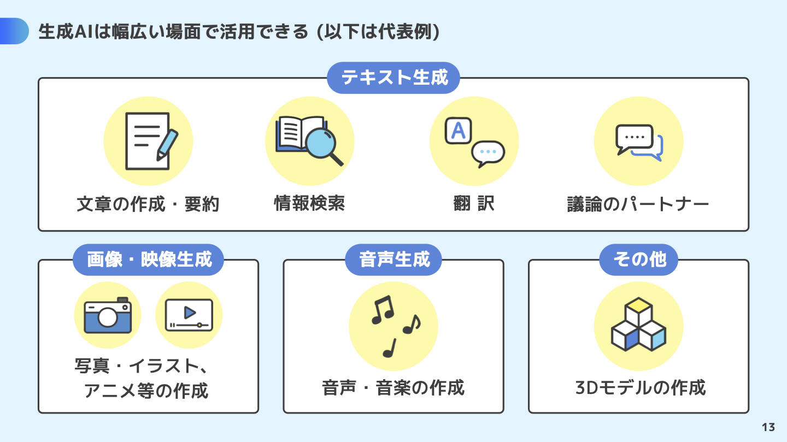
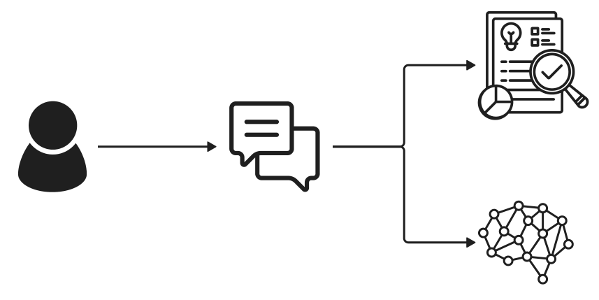

# プロンプトエンジニアリング


```
生成AIの活用方法・ユースケースについての、フラットでシンプルでモダンなイラスト
```

### 目次

[TOC]

---

## 1-1 限目：生成 AI 活用のユースケース (15:40-)

### 講義の目的

この講義の主な目的は、人工知能（AI）技術の現在の応用と、それに伴う倫理的課題について深い理解を促すことです。　　
AI が社会に与える影響は計り知れず、これには多くの利益と同時に様々なリスクや倫理的問題が伴います。
AI 技術使用に関連する倫理的考慮を教育することで、未来の技術者、研究者、ポリシーメーカーが責任ある判断を下すための基盤を築くことを目指します。

| 回数     |     1      |        2        |                **3**                |                    4                    |                    5                    |                    6                    |     7      |             8-14             |
| -------- | :--------: | :-------------: | :---------------------------------: | :-------------------------------------: | :-------------------------------------: | :-------------------------------------: | :--------: | :--------------------------: |
| テーマ   |  AI 基礎   | AI の活用と倫理 | **プロンプトエンジニアリング:概要** | プロンプトエンジニアリング:アプリ生成 ① | プロンプトエンジニアリング:アプリ生成 ② | プロンプトエンジニアリング:アプリ生成 ③ |  総合演習  | フィジカルコンピューティング |
| 担当講師 | 小島、伊藤 |      小島       |              **伊藤**               |                  小島                   |                  伊藤                   |                  小島                   | 伊藤、小島 |           白石先生           |

### アイスブレイク (10 分)

```
朝ごはん何食べました？
1. パン
2. ごはん
3. その他
4. 食べてない
```

```
1週間で生成AI使いました？
1. ほぼ毎日
2. 数回
3. ほぼ使ってない
```

```
Meta 社のオープンソースLLM llama3が公開されたこと知ってます？
1. 知ってる
2. なにそれおいしいの？
```

- [Meta Llama 3](https://llama.meta.com/llama3/)
- [HuggingChat](https://huggingface.co/chat/)

```
Adobe のライセンス持ってる？
1. 持っている
2. 持っていない
```

```
HTML/css触ったことある？
1. ある
2. ちょっとだけ
3. なにそれおいしいの？
```

### 前回の振り返り (10 分)

- 生成 AI と関連する重要な用語と技術
- AI と職業に与える影響
- AI 倫理
- AI リスク対策演習

> [!NOTE]
> 前回のノートを要約してみよう

> この文章は、AI 技術の活用と倫理に関する講義内容を詳述しています。主に、AI の基礎と応用、倫理的課題、そして AI 技術が職業に与える影響に焦点を当てています。講義では、生成 AI や大規模言語モデルなどの技術的側面に加えて、AI が職業や社会に与える潜在的影響を探求し、AI 倫理について深く議論しています。具体的な技術解説にはトランスフォーマーや自己教師あり学習が含まれ、AI の応用が労働市場に与える効果を「労働保管型」と「労働置換型」の観点から評価しています。さらに、AI 倫理のセッションでは AI のリスクと対策について説明し、具体的な事例を通じて理解を深めるアプローチが取られています。

### 利用する生成 AI (5 分)

- [ChatGPT](https://chat.openai.com/)
- [Copilot](https://copilot.microsoft.com/)
- [Adobe Firefly](https://firefly.adobe.com/)

### 生成 AI はどのように使われている？ (5 分)

> [!NOTE]
> 生成 AI の使われ方を調べてみよう

```
生成AIを活用方法を教えて
```

```
生成AIのユースケースを教えて
```

### 生成 AI の種類と使われ方 (10 分)

#### 総務省

- [生成 AI はじめの一歩～生成 AI の入門的な使い方と注意点～ | 安心・安全なインターネット利用ガイド | 総務省](https://www.soumu.go.jp/use_the_internet_wisely/special/generativeai/)
- [生成 AI はじめの一歩](https://www.soumu.go.jp/use_the_internet_wisely/special/generativeai/data/file01.pdf)



> [!NOTE]
> 上記サイトを要約してみよう

> [!NOTE]
> ChatGPT 4 に pdf ファイルをアップロードしてみよう

#### 文部科学省

- [生成 AI の利用について：文部科学省](https://www.mext.go.jp/a_menu/other/mext_02412.html)
- [初等中等教育段階における生成 AI の利用に関する暫定的なガイドライン](https://www.mext.go.jp/content/20230710-mxt_shuukyo02-000030823_003.pdf)
- [大学・高専における生成 AI の教学面の取扱いについて：文部科学省](https://www.mext.go.jp/b_menu/houdou/2023/mext_01260.html)

#### デロイト

- Text
- Image
- Audio
- Video
- Code
- 3d/Specialized

- [Gen AI use cases by type and industry | Deloitte US](https://www2.deloitte.com/us/en/pages/consulting/articles/gen-ai-use-cases.html)

#### IBM

- 要約
- セマンティック検索
- コンテンツ作成
- コード作成

- [生成 AI のユースケースと潜在的リスク : 問題点やデメリットはないのか？ | IBM ソリューション ブログ](https://www.ibm.com/blogs/solutions/jp-ja/exploring-generative-ai-to-maximize-experiences-decision-making-and-business-value/)
- [CEO のための生成 AI 活用ガイド - 総集編 | IBM](https://www.ibm.com/thought-leadership/institute-business-value/jp-ja/report/ceo-generative-ai-jp)

### 生成 AI を組み込んだシステム (5 分)

#### RAG (Retrieval-Augmented Generation：検索拡張生成)

Copilot 等は、検索機能と生成 AI（LLM）を組み合わせて RAG (Retrieval-Augmented Generation) と呼ばれる方法で実現しています。

> 生成系 AI／LLM（大規模言語モデル）の RAG（Retrieval-Augmented Generation：検索拡張生成）とは、ChatGPT や Gemini に代表されるチャット AI に独自の情報源を付与する仕組みのことで、具体的には言語モデルによるテキスト生成に特定の知識や情報源（例えばナレッジベースなど）への検索を組み合わせることである。



- [RAG（Retrieval-Augmented Generation：検索拡張生成）とは？：AI・機械学習の用語辞典 - ＠IT](https://atmarkit.itmedia.co.jp/ait/articles/2403/13/news035.html)
- [RAG とは何ですか? - 検索拡張生成の説明 - AWS](https://aws.amazon.com/jp/what-is/retrieval-augmented-generation/)
- [Retrieval-Augmented Generation(RAG)とは？ | IBM ソリューション ブログ](https://www.ibm.com/blogs/solutions/jp-ja/retrieval-augmented-generation-rag/)

## 1-2 限目： 「授業」のユースケース (16:35-)

> [!WARNING]
> 自分の言葉で考えるトレーニングも大切です。
>
> 生成 AI の言葉を鵜呑みにするのは危険です。
>
> 生成 AI の内容をそのまま利用する行為は推奨していません。

参考：

> ○ 生成 AI と学修活動との関係性、成績評価：
> 大学・高専における学修は学生が主体的に学ぶことが本質であり、生成 AI の出力をそのまま用いるなど学生自らの手によらずにレポート等の成果物を作成することは、学生自身の学びを深めることに繋がらないため、一般に不適切と考えられること。また、生成 AI の出力に著作物の内容がそのまま含まれていた場合、これに気付かずに当該出力をレポート等に用いると、意図せずとも剽窃に当たる可能性があること。

[大学・高専における生成 AI の教学面の取扱いについて（周知）](https://www.mext.go.jp/content/20230714-mxt_senmon01-000030762_1.pdf)

### インプット

#### 英語記事の翻訳 (5 分)

> [!NOTE]
> 英語のサイトを翻訳してみよう

例：

- [KYOTO UNIVERSITY OF THE ARTS](https://www.kyoto-art.ac.jp/en/)
- [Kyoto Travel Guide - What to do in Kyoto City](https://www.japan-guide.com/e/e2158.html)
- [OpenAI](https://openai.com/)

#### 資料の要約 (5 分)

> [!NOTE]
> 資料を要約してみよう

参考：

- [青空文庫　 Aozora Bunko](https://www.aozora.gr.jp/)
- [生成的人工知能 - Wikipedia](https://ja.wikipedia.org/wiki/%E7%94%9F%E6%88%90%E7%9A%84%E4%BA%BA%E5%B7%A5%E7%9F%A5%E8%83%BD)
- [Generative artificial intelligence - Wikipedia](https://en.wikipedia.org/wiki/Generative_artificial_intelligence)

> [!NOTE]
> URL を指定して聞いてみよう

```
https://www.kyoto-art.ac.jp/
このページに書かれていることを要約して
```

> [!NOTE]
> ファイルをアップロードして聞いてみよう

#### 画像の説明 (5 分)

> [!NOTE]
> 画像を説明してもらおう

- [Copilot](https://copilot.microsoft.com/)
- [LLaVA](https://llava.hliu.cc/)

#### 深掘り (5 分)

> [!NOTE]
> 資料の内容について生成 AI と対話してみよう
>
> 疑問に思ったことや、知りたいことをもっと聞いてみよう

### アウトプット

#### レポートのアイデア出し (5 分)

> [!NOTE]
> AI 倫理についてのレポート構成を考えてもらおう

#### レポートの生成 (5 分)

> [!NOTE]
> AI 倫理についてのレポートの中身を記載してもらおう

#### レポートの推敲 (5 分)

> [!NOTE]
> 自分の感想も追加して、レポートを推敲してもらおう

#### プレゼン資料の作成 (5 分)

> [!NOTE]
> 同じようにプレゼン資料の構成を考えてもらおう

#### プレゼン資料に追加する画像の作成 (5 分)

> [!NOTE]
> 資料につけるイラストを書いてもらおう

```
「生成AIについて」というタイトルのプレゼン資料に使うイラストを作って
```

> [!WARNING]
> 著作権等の「合法性」に注意
>
> 偏見等の「社会的受容性」に注意

## 2-1 限目： 「創作活動」のユースケース (17:30-)

### 創作活動のアイデア出し・フィードバック

#### アイデア出し (5 分)

> [!NOTE]
> 卒業制作のアイデアを出してもらおう

#### アイデアのフィードバック (5 分)

> [!NOTE]
> アイデアについてフィードバック（良いところ・改善が必要なところ）をもらおう

#### 深掘り (5 分)

> [!NOTE]
> よりアイデアを広げるために、疑問に思ったところや感じたことを伝えて深掘りして聞いてみよう

#### 作品へのフィードバック (5 分)

> [!NOTE]
> 作品（画像）についてアドバイスしてもらおう

- [Copilot](https://copilot.microsoft.com/)
- [LLaVA](https://llava.hliu.cc/)

### ポートフォーリオサイト

#### 構成を考える (5 分)

> [!NOTE]
> ポートフォーリオサイトの構成案を出してもらおう

#### 作品のキャプションを考える (5 分)

> [!NOTE]
> 画像について説明してもらおう

- [Copilot](https://copilot.microsoft.com/)
- [LLaVA](https://llava.hliu.cc/)

> [!WARNING]
> 自分の言葉で考えることは大前提ですが。

#### バックグラウンドミュージックをつける (5 分)

> [!NOTE]
> 興味のある方はぜひ試してみてください

- [Suno](https://suno.com/)

#### WEB サイトを作る (10 分)

> [!NOTE]
> ポートフォーリオサイトの HTML ファイルと css ファイルを作成してみよう

```
モダンでクールなフラットデザインのポートフォーリオサイトを、HTMLとcssで作成して
```

## 2-2 限目： 「就職活動」のユースケース (18:25-)

### 自己分析と計画

#### 自己分析 (5 分)

> [!NOTE]
> AI とロールプレイして、自己分析をしてみよう

```
あなたは就職活動のアドバイザーです
自己分析をしたいので、質問してください
```

#### タスク化 (5 分)

> [!NOTE]
> 就職活動に必要なタスクを洗い出そう

```
あなたは就職活動のアドバイザーです
就職活動に向けて必要な準備を教えてください
```

#### キャリア相談 (5 分)

> [!NOTE]
> キャリアについて相談し、情報を整理しよう

```
あなたは就職活動のアドバイザーです
私は、芸術大学で「ビジネス（B）」「テクノロジー（T）」「クリエイティブ（C）」を学んでいます。どのようなキャリアが考えられるでしょうか。
```

#### Copilot（RAG）を利用して情報収集 (5 分)

> [!NOTE]
> 気になる企業や団体について情報収集しよう

### 応募

#### 履歴書（志望動機）の作成 (5 分)

> [!NOTE]
> 志望動機に何を書くべきか聞いてみよう

> [!NOTE]
> 内容を箇条書きにして、文章にしてもらおう

#### 履歴書（自分 PR）の作成 (5 分)

> [!NOTE]
> 志望動機に何を書くべきか聞いてみよう

> [!NOTE]
> 内容を箇条書きにして、文章にしてもらおう

#### 面接の想定質問と回答 (5 分)

> [!NOTE]
> AI に面接官を演じてもらい、ロールプレイしてみよう

```
あなたは、xxの新卒面接官です。応募者である私に質問してください。
```

#### メール作成 (5 分)

> [!NOTE]
> 面接後のお礼メールを書いてみよう

> [!NOTE]
> 面接時の印象も加えて文章を推敲しよう

### その他 (5 分)

#### 3D モデル生成

- [DreamGaussian](https://dreamgaussian.github.io/)

#### 動画

- [Sora](https://openai.com/sora)
- [AI による動画編集の自動化 | Adobe](https://www.adobe.com/jp/products/premiere/ai-video-editing.html?clickref=1100lyr3nuoo&mv=affiliate&mv2=pz&as_camptype=&as_channel=affiliate&as_source=partnerize&as_campaign=skimlinks_phg)

#### コード

- [GitHub Copilot · Your AI pair programmer](https://github.com/features/copilot)
- [Cursor - The AI-first Code Editor](https://cursor.sh/)

## 参考

各パート参照
