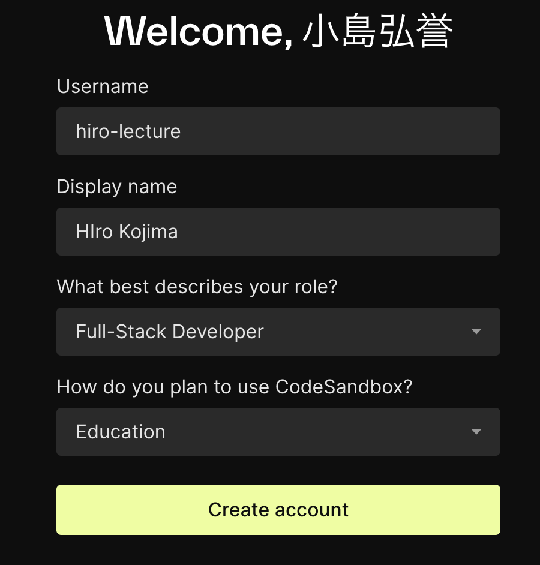
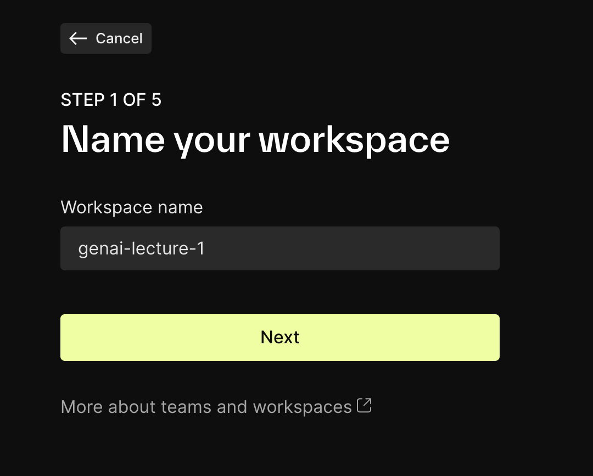
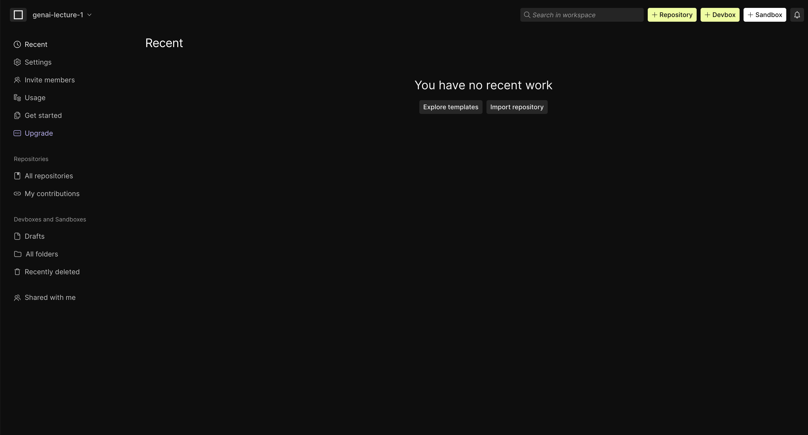
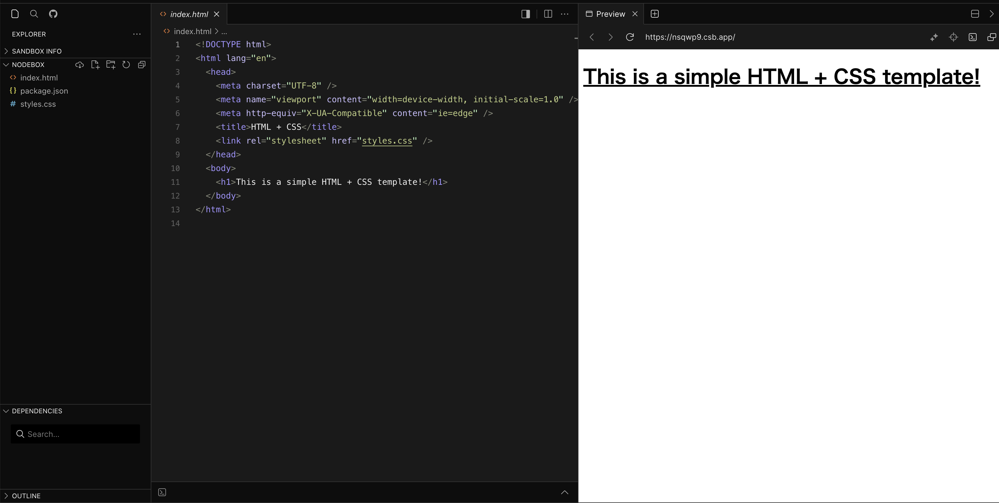
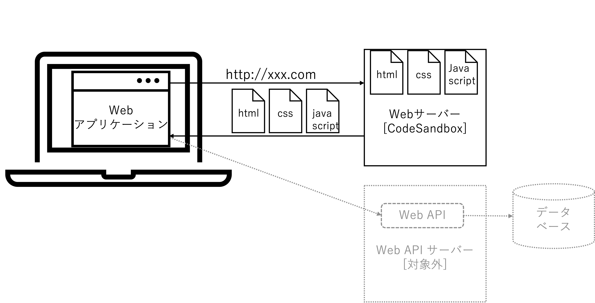
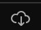
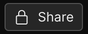
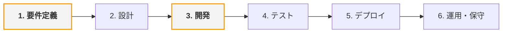
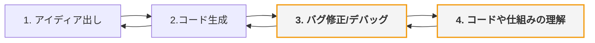

[TOC]

# プロンプトエンジニアリング ~ アプリケーション開発① ~

## 4限前半 (45分)

### 1.1 導入 (10分)

#### 4限出席コード

出席コードをslackに投稿します。

#### 講義の目的 

この講義の主な目的は、人工知能（AI）技術の現在の応用と、それに伴う倫理的課題について深い理解を促すことです。　　
AI が社会に与える影響は計り知れず、これには多くの利益と同時に様々なリスクや倫理的問題が伴います。
AI 技術使用に関連する倫理的考慮を教育することで、未来の技術者、研究者、ポリシーメーカーが責任ある判断を下すための基盤を築くことを目指します。

| 回数     |     1      |        2        |              **3**              |                      4                      |                    5                    |                    6                    |     7      |             8-14             |
| -------- | :--------: | :-------------: | :-----------------------------: | :-----------------------------------------: | :-------------------------------------: | :-------------------------------------: | :--------: | :--------------------------: |
| テーマ   |  AI 基礎   | AI の活用と倫理 | プロンプトエンジニアリング:概要 | **プロンプトエンジニアリング:アプリ生成 ①** | プロンプトエンジニアリング:アプリ生成 ② | プロンプトエンジニアリング:アプリ生成 ③ |  総合演習  | フィジカルコンピューティング |
| 担当講師 | 小島、伊藤 |      小島       |              伊藤               |                  **小島**                   |                  伊藤                   |                  小島                   | 伊藤、小島 |           白石先生           |

### アイスブレイク 

> [!NOte]
>
> 今日は何時に起きた?

```
今日の朝何時に起きた?
:one: 5:00AM~7:00AM
:two: 8:00AM~10:00AM
:three: 10:00AM~12:00AM
:four: 上記以外
```

> [!Note]
>
> 今日のお昼はどこで食べた?

```
今日のお昼はどこで食べた?
:one: 自宅
:two: 大学の構内
:Three: お店
:four: バイト先
:five: 上記以外
```

> [!Note]
>
> 自分のスマートフォンから大学のSlackにアクセスできる?

```
:one: アクセスできる
:two: できない
:three: わからない
```


### 1.2 Webアプリケーション開発環境 セットアップ (15分)

1. **公式サイトにアクセス**

   - Webブラウザで[CodeSandbox](https://codesandbox.io/)の公式サイトにアクセスします。

2. **Sign Upボタンをクリック**

   - 画面右上にある「Sign In」ボタンをクリックしても新規アカウントの作成します。

3. **Googleアカウントでのサインアップ**

   - 表示されたサインアップページで「Continue with Google」を選択します。
   - Googleアカウントにサインインするよう求められるため、Googleのログイン情報を入力します。

4. **アカウント作成**

   - Username等を設定します。

     

   - NameSpaceは本講義とわかるように`genai-lecture`を設定します。

     

   - Freeプランを選択します。

     > [!caution]
     >
     > Freeプランは20 Sandboxが上限になります。
     
     


1. **新規アカウントの作成完了**

   - 許可後、CodeSandboxのダッシュボード画面にリダイレクトされます。

     

2. **プロジェクトの作成**

   - 画面右上の「+Sandbox」ボタンをクリックし、新しいプロジェクトを作成します。

   - プロジェクト名は`HelloWorld`としてください。

   - テンプレートから`HTML+CSS`を選択します。

   - 以下のように表示できれば正常にプロジェクトを作成できています。

     

### 1.3 動作確認してみよう (15分)

> [!NOTE]
>
> Hello Worldを表示してみよう。

以下のプロンプトを参考にHelloWorldを表示するためのhtmlとcssを作成してください。
作成したhtmlとcssをcodesandboxに貼り付け、正常動作を確認してください。
正常動作を確認できたら、slackにスクリーンショットをはりましょう。

```
オシャレなHelloWorldを表示するWebページのhtmlとcssを作成してください。
また、以下の要件も満たしてください。
- 全てのファイルはルートフォルダに配置
- htmlのファイル名はindex.html
- cssのファイル名はstyles.css
```

> [!Note]
>
> 生成AIにSandBoxとDevBoxの違いを聞いてみよう。
>
> - [ChatGPT](https://chatgpt.com/?oai-dm=1)
> - [Copilot](https://copilot.microsoft.com/)
> - [Gemini](https://gemini.google.com/?hl=ja) (Geminiを利用する歳は個人のGmailアカウントでログインする必要があります。)


## 休憩(10分)

## 4限後半 (45分)

### 2.1 Webアプリケーションの復習 (10分)

#### Webアプリケーションとは

1. **Webアプリケーションの概要**

   - Webアプリケーションは、インターネットを介してユーザーがアクセスできるアプリケーションソフトウェアのことです。
   - ユーザーはWebブラウザを使ってアクセスし、検索、閲覧、データの入力や管理などの操作を行えます。
   - 例として、SNS、オンラインショッピングサイト、ブログプラットフォーム、ビデオストリーミングサービスなどがあります。

2. **Webアプリケーションの構造**

   - Webアプリケーションは、一般的に3つの主要な構成要素から成り立っています。

   **2.1 クライアント側 (フロントエンド)**

   - クライアント側は、ユーザーが直接操作するインターフェースを担当します。
   - HTML（コンテンツの構造）、CSS（デザイン）、JavaScript（動的機能）などの技術が使われ、見た目や操作性を提供します。

   **2.2 サーバー側 (バックエンド)**

   - サーバー側は、リクエストを処理し、データの読み取りや書き込み、ビジネスロジックを実行します。
   - 一般的なプログラミング言語（JavaScript、Python、Java、Rubyなど）を使って書かれ、API（アプリケーションプログラミングインターフェース）を介してクライアントにサービスを提供します。

   **2.3 データベース**

   - データベースは、アプリケーションのデータ（ユーザー情報、投稿、商品など）を保存、管理します。
   - リレーショナルデータベース（SQLを使用するMySQL、PostgreSQLなど）や、非リレーショナルデータベース（NoSQLのMongoDBなど）があります。




> [!Note]
>
> 生成AIを活用して、Webアプリケーションの理解を深めよう。
> 自分の疑問点を生成AIに質問してみましょう。

```
(例)
- Webアプリにおけるクライアント側でブラウザ以外を利用するケースはありますか?
- Webアプリケーションとクラウドサービスの違いはなんですか?
```


### 2.2 簡易なWebアプリケーションを作ってみよう。(15分)

#### ポートフォリオサイト

> [!Note]
> ポートフォリサイトをを作成してみよう ([前講義「創作活動」のユースケース」から](../3_prompt_engineering/readme.md))

codesandboxで新しいフォルダ(portfolio)を作成したあとで、ポートフォリオサイトを作成してみてください。

```
モダンでクールなフラットデザインのポートフォーリオサイトを、HTMLとcssで作成してください。
また、以下の要件も満たしてください。
- 全てのファイルはルートフォルダに配置
- htmlのファイル名はindex.html
- cssのファイル名はstyles.css
```

#### タイマーアプリ

> [!Note]
>
> タイマーアプリを作成してみよう

```
タイマーアプリを作成してください。HTML、css、JavaScriptで作成してください。
また、以下の要件も満たしてください。
- 全てのファイルはルートフォルダに配置
- htmlのファイル名はindex.html
- cssのファイル名はstyles.css
- javascriptのファイル名はscript.js
```

#### クイズアプリ

> [!Note]
>
> クイズアプリを作成してみよう

```
クイズアプリを作成してください。HTML、css、JavaScriptで作成してください。
また、以下の要件も満たしてください。
- 全てのファイルはルートフォルダに配置
- htmlのファイル名はindex.html
- cssのファイル名はstyles.css
- javascriptのファイル名はscript.js
```


### 2.3 Webアプリケーションを共有してみよう。(15分)

#### CodeSandboxでアプリケーションを共有する方法

CodeSandboxでは、Webアプリケーションを共有する方法がいくつか用意されています。主に以下の方法があります。本講義では1と2を扱うため、それらの方法を説明します。

1. **ファイルダウンロードによる共有**:
   - CodeSandboxは、プロジェクトをローカル環境にダウンロードしてZIPファイルとして手動で共有することができます
2. **ライブURLの共有**
   - CodeSandboxは、プロジェクトごとにユニークなURLを生成します。このURLを他人と共有することで、作成したアプリケーションを簡単に見せることができます。
3. **埋め込み（Embedding）**:
   - CodeSandboxでは、生成されたプロジェクトをウェブサイトやブログに埋め込むことができます。これにより、他のウェブページの中で直接プロジェクトを表示し、インタラクティブに利用できます。

#### ファイルダウンロードによる共有方法

1. **ファイルのダウンロード**

- NODEBOXの「ダウンロード」アイコンをクリックします。
- ZIP形式でファイルがダウンロードされます。

2. **ファイルの共有**

- Slack等でダウンロードしたZIPファイルを共有します。

> [!note]
>
> タイマーアプリのファイルをダウンロードし、Slackで共有してみよう。


#### ライブURLの共有方法

1. **プロジェクトを開く**:
   - CodeSandboxにログインし、既存のサンドボックスを開きます。
2. **プロジェクトを設定する**:
   - サンドボックス画面の上部にある「Share」アイコンをクリックします。
   - 「Change Permission」セクションを見つけて、「Private」から「Unlisted」に変更します。これにより、サンドボックスは検索結果に表示されず、URLを知っている人のみがアクセスできるようになります。
3. **URLを共有する**:
   - Perviewタブに記載されているURLをコピーし、必要な人だけに共有します。
   - URLを知っている人だけがアクセスできるため、広く公開されることはありません。
4. **確認**:
   - URLを共有した人がサンドボックスにアクセスできるかどうかを確認します。共有したURLを使って、異なるブラウザやプライベートモードでアクセスしてみると良いでしょう。
5. **注意点**:
   - 「Unlisted」設定は、完全なプライバシーを提供するものではありません。URLを知っている人は誰でもアクセスできます。
   - 必要に応じて、追加の認証やアクセス制限をアプリケーション内で実装することを検討してください。


> [!Note]
>
> QuizアプリのライブURLを共有してみよう。


## 休憩(10分)


## 5限前半(45分)

### 5限出席コード

出席コードをslackに投稿します。


### 3.1 Webアプリケーションの開発プロセスと生成AIの活用 (40分)

Webアプリケーションの開発プロセスは、プロジェクトの要件や規模に応じて変化しますが、一般的なプロセスの流れは次のようになりますが、
本講義では要件定義及び開発に着目して、講義を進めます。



#### <mark>1. 要件定義</mark>

- <mark>**要件定義**：クライアントやプロジェクトの関係者からニーズを聞き、機能や仕様を明確にする。</mark>
- **企画・計画**：機能の優先順位、リソース、スケジュール、予算を策定し、プロジェクト全体の見通しを立てる。

> [!Note]
>
> Webアプリケーションを実現するために必要な機能一覧を出してもらう

```
(例)
私は家族でキャンプにでかける予定があります。
そのキャンプで家族のコミュニケーションを盛り上げるためWebアプリケーションでゲームを作りたいと考えています。
キャンプで見かけた植物や昆虫を調査し、調査したものを日付とともに記録できるWebアプリケーションを作りたいです。

そのWebアプリケーションを実現するための機能一覧を書いてもらえませんか。
```

> [!Note]
>
> 要件を伝えて、必要な機能を絞ってもらう

```
(例1)
私はWebアプリケーション初心者のため、できるかぎり簡単に実現したいです。上記の中で必ず必要な機能はどれでしょうか。
```

```
(例2)

```


#### 2. 設計

- **アーキテクチャ設計**：システムの全体像（クライアント、サーバー、データベースなどの連携）を決定。
- **UI/UX設計**：ユーザーインターフェースやユーザー体験をデザインし、ユーザーフローやワイヤーフレームを作成。
- **データベース設計**：データの構造やリレーションシップを計画し、効率的なデータ処理を可能にする。

- 

> [!Note]
>
> 

#### <mark>3. 開発</mark>

- <mark>**フロントエンド開発**：ユーザーインターフェース部分を作成し、アニメーションやフォームなどの動的な機能も実装。</mark>
- **バックエンド開発**：サーバー側のビジネスロジック、データ処理、API、認証システムなどを実装。
- **データベース構築**：事前に設計したデータベーススキーマに基づいて、データベースを作成し接続する。

> [!Note]
>
> 

#### 4. テスト

- **ユニットテスト**：個々のモジュールやコンポーネントの機能を確認。
- **統合テスト**：複数のモジュールが連携して機能するかを確認。
- **ユーザビリティテスト**：ユーザーの観点から使いやすさやUIの改善点を探る。
- **パフォーマンステスト**：システム全体の負荷、応答速度、スケーラビリティをテストする。

> [!Note]
>
> 

#### 5. デプロイ

- **デプロイ**：テストが完了したアプリケーションを本番環境にリリース。

> [!Note]
>
> 

#### 6. 運用・保守

- **監視**：アプリケーションの稼働状況やパフォーマンスの監視。
- **メンテナンス**：セキュリティやパフォーマンスの向上、不具合の修正。
- **機能改善**：ユーザーからのフィードバックに基づいた機能の追加や改善。

> [!Note]
>
> 

## 休憩(10分)

## 5限後半(45分)

### 4.1 より複雑なWebアプリケーションを作ってみよう。(45分)

簡易なWebアプリケーションであれば、生成AIが1回のリクエストでほしいコードを生成してくれますが、
複雑なアプリケーションを作ろうとうまく動作しなかったりします。
以下のプロセスを参考にしながら、生成AIを活用して、バグ修正やコードやWebアプリケーションの仕組みを理解してみましょう。



#### 画像共有サイト (10分)

> [!note]
>
> 画像共有サイトを生成してみよう

> [!Note]
>
> 画像が共有できないバグを修正してみよう

> [!Note]
>
> コードを理解してみよう

#### 認証つきQuizサイト (10分)

<strong><span style="color: red;">※このやり方は脆弱な認証であり、機密/個人情報等は入れないこと</span></strong>

> [!Note]
>
> クイズサイトを合言葉がないと使えないようにしてみましょう。


---

以下メモ

1. **ChatGPTを利用したコード生成の基本 (30分)**
   - ChatGPTを使用してコードを生成する方法の紹介
   - 実際の仕様を定義してChatGPTにコードを生成させるデモンストレーション
   - コード生成のための効果的なプロンプトの書き方
2. **アプリケーションの構築開始 (50分)**
   - 静的なWebページの作成
     - HTMLとCSSを使用して基本的なWebページの構造とスタイルを設計。
   - 静的なWebページへの画像の埋め込み
     - HTMLを使ってWebページに画像を挿入する方法を学ぶ。
   - 画像アップロード機能の追加
     - ファイル入力を使用して画像をアップロードし、サーバーに保存するプロセスを実装。
   - フォーム入力とバリデーション
     - ユーザー入力を受け取るフォームの作成と、JavaScriptやサーバーサイドでの入力検証を行う。
   - 動的なコンテンツの生成
     - JavaScriptやサーバーサイドスクリプトを利用して、ユーザーのリクエストに基づきコンテンツを動的に生成。
   - ユーザーの操作に応じてページ内容を動的に変更
     - JavaScriptやAJAXを使用して、ページの再読み込みなしにコンテンツを更新する方法を学ぶ。
   - ユーザー登録・ログイン機能
     - ユーザー認証のためのシステムを設計し、セキュリティの基本についても触れる。
3. **デバッグと問題解決 (40分)**
   - 生成されたコードのデバッグ方法
   - コンソールを使用したエラー解析と修正
   - ブラウザの開発者ツールを使ったテストと調整
4. **演習とフィードバックセッション (40分)**
   - 生徒が独立してアプリケーションを完成させる時間
   - 各生徒のアプリケーションの発表とフィードバック
   - 疑問点や問題の解決策の共有
5. **まとめと次回へのつなぎ (10分)**
   - 本日の講義の要点の復習
   - 追加リソースの提供と自習の奨励
   - 次回講義の予告と生徒からのフィードバックの収集


