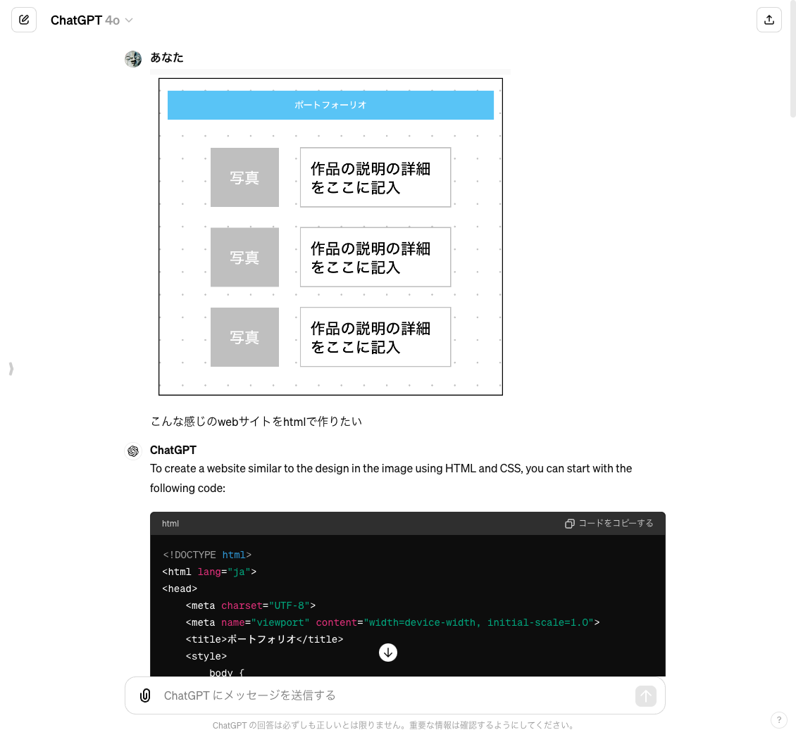
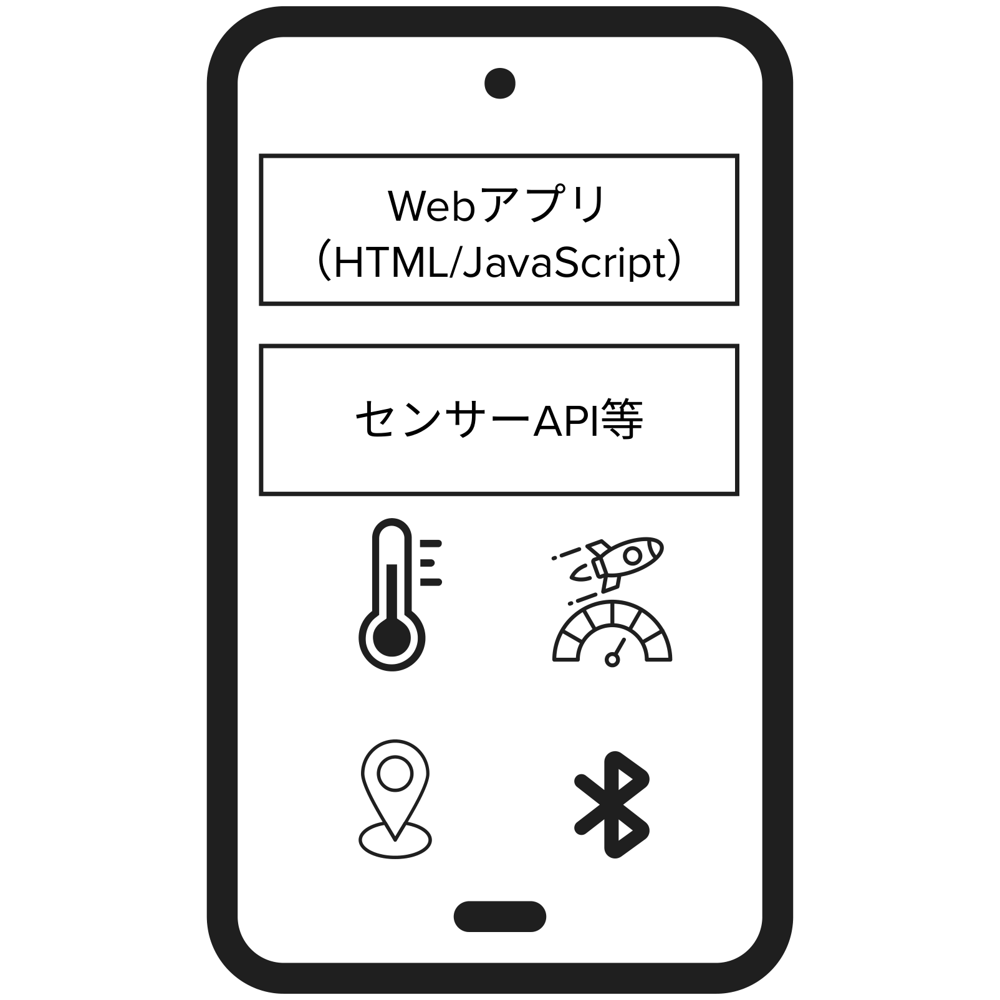
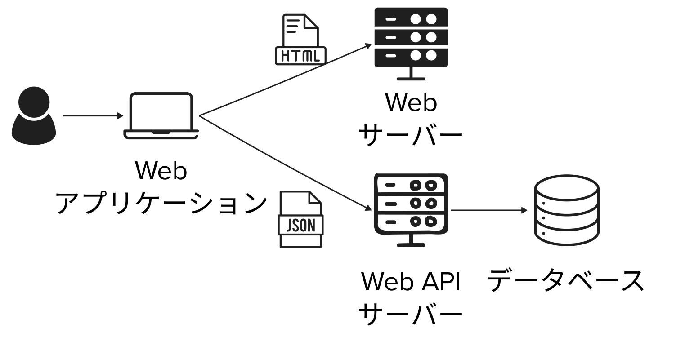
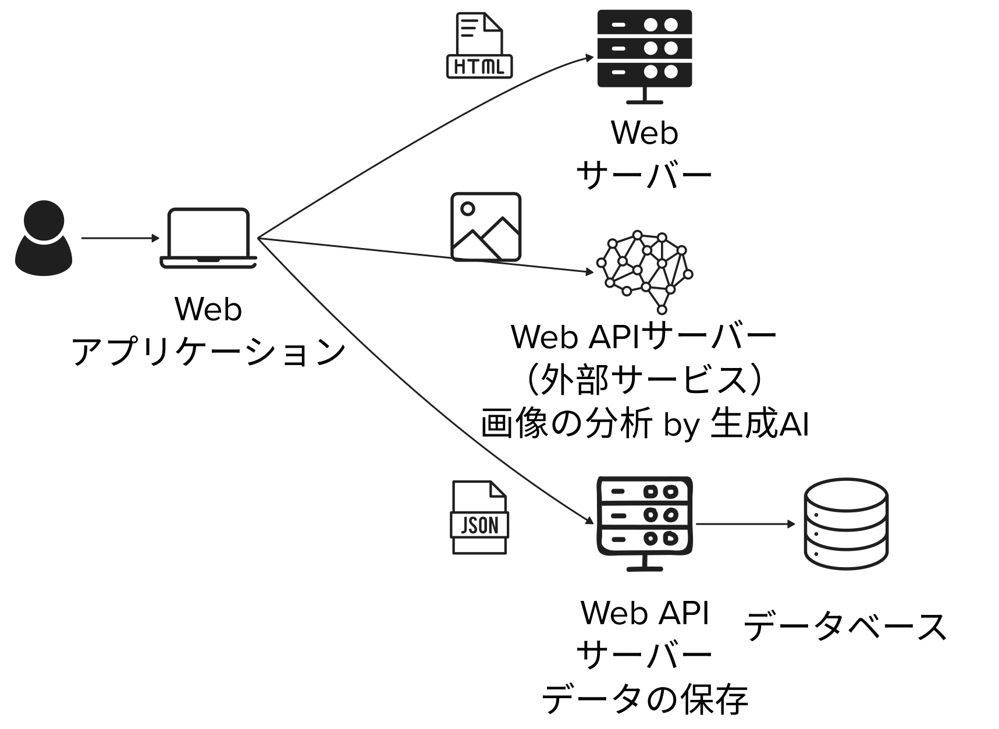

# プロンプトエンジニアリング ~ アプリケーション開発 ② ~


```
下記タイトルの授業のモダンでフラットでシンプルなトップ画像を横長で書いて

HTML と CSS と JavaScript 〜動きのあるサイトを作ろう〜
```

### 目次

[TOC]

---

## 1-1 限目：振り返りと Web サイト・Web アプリの基礎 (15:40-)

### 講義の目的

この講義では、生成 AI（人工知能）活用方法の基本を学び、AI を用いた創作活動の可能性に焦点を当てます。学生には、AI 技術がクリエイティブな分野でどのように利用され、どのような影響を与えるかを理解してもらうことが目的です。この講義を通じて、学生は AI を活用した Web アプリケーション開発手法を身につけることができるようになります。最終的には、技術の進歩を活かして個人の創造性をさらに伸ばすための知識と技術を提供します。

| 回数     |     1      |        2        |              **3**              |                    4                    |                      5                      | 6          | 7          | 8-14                         |
| -------- | :--------: | :-------------: | :-----------------------------: | :-------------------------------------: | :-----------------------------------------: | ---------- | ---------- | ---------------------------- |
| テーマ   |  AI 基礎   | AI の活用と倫理 | プロンプトエンジニアリング:概要 | プロンプトエンジニアリング:アプリ生成 ① | **プロンプトエンジニアリング:アプリ生成 ②** | 総合演習 ① | 総合演習 ② | フィジカルコンピューティング |
| 担当講師 | 小島、伊藤 |      小島       |              伊藤               |                  小島                   |                  **伊藤**                   | 小島       | 伊藤、小島 | 白石先生                     |
| 開催方法 | オンサイト |    リモート     |            リモート             |                リモート                 |                  リモート                   | オンサイト | オンサイト |                              |

### アイスブレイク (10 分)

> [!Note]
>
> OpenAI のニュースみた？

```
OpenAI のニュースみた？
1. GPT-4o やばい
2. GPT-4o ってのが出たのは知ってる
3. なにそれ美味しいの？
```

> [!Note]
>
> - 無料ユーザーにも提供
> - GPT-4Turbo の 2 倍高速・半額・5 倍まで利用可能
> - 画像の理解度が向上
> - 音声で会話できる

参考：
[Spring Update | OpenAI](https://openai.com/index/spring-update/)

> [!Note]
>
> Google I/O のニュースみた？

```
Google I/O のニュースみた？
1. Googleさすが
2. なんかしてたのは知ってる
3. なにそれ美味しいの？
```

> [!Note]
>
> - 2 M token context window
> - マルチモーダル推し
> - 動画生成 Veo

参考：
[Google I/O 2024](https://io.google/2024/intl/ja/)

> [!Note]
>
> 昨日いつ寝た？

```
昨日いつ寝た？
1. 20:00-22:00
2. 22:00-24:00
3. 0:00-2:00
4. 2:00-6:00
5. 上記以外
```

> [!Note]
>
> 前回の授業で、期待どおりのサイトを作れた？

```
前回の授業で、期待どおりのサイトを作れた？
1. いい感じ
2. まあまあ
3. ふつう
4. 微妙
5. 全然
```

```
動かなかった・微妙だった・もっとこうだったらいいのに
1. 機能（画像アップロード・検索等）が実装できなかった
2. 見た目が微妙だった
3. もっと動きが欲しい
4. その他
```

> [!Note]
>
> Maker Faire Kyoto 2024 行きました？

```
Maker Faire Kyoto 2024 行きました？
1. 出展した
2. 見に行った
3. 行けなかった
4. なにそれおいしいの？
```

[Maker Faire Kyoto 2024 | Make: Japan](https://makezine.jp/event/mfk2024/)

> [!Note]
>
> HTML と CSS と JavaScript どれくらい知ってる？

```
HTML どれくらい触ったことある？
1. そこそこ
2. なんとなく
3. 全然
```

```
CSS どれくらい触ったことある？
1. そこそこ
2. なんとなく
3. 全然
```

```
JavaScript どれくらい触ったことある？
1. そこそこ
2. なんとなく
3. 全然
```

### 前回の振り返り (10 分)

> [!Tip]
>
> HTML、CSS、JavaScript って何？
>
> 必要に応じて、深掘りして聞いてみよう

> [!Tip]
>
> Web アプリケーションの構造を教えて

> [!Tip]
>
> CodeSandbox って何？
>
> 必要に応じて、深掘りして聞いてみよう

### 前回の振り返り (20 分)

> [!Note]
>
> 友人に頼まれて、友人の会社（or お店 or コミニティ）の Web サイトを作ることになりました。
>
> 1. どんな会社か決めよう
> 2. 誰に何を伝えるサイトか決めよう
> 3. どんなコンテンツが必要か決めよう
> 4. トップページを作ってみよう
> 5. 共有してみよう

例：

```
下記説明を元に、HTML、CSS、JavaScriptでコーポレートサイトを書いて

# 会社
ビールの醸造所とバー。小さいけれど、こだわってる。おしゃれ。

# 誰向けのサイト？
ビールは大好きってほどじゃないけど、変わったビールは飲んでみたい
20代から30代
洒落た雰囲気を楽しみたい
久しぶりに会う友人と飲むために店を選んでいて、google map経由で気になってのぞいてみた

# 要件
- 全てのファイルはルートフォルダに配置
- htmlのファイル名はindex.html
- cssのファイル名はstyles.css
```

> [!Tip]
>
> [co-creation-with-genai/2024/4_webapp_dev_with_ai/readme.md at main · Creative-Cucumbers/co-creation-with-genai](https://github.com/Creative-Cucumbers/co-creation-with-genai/blob/main/2024/4_webapp_dev_with_ai/readme.md)

### 画像から生成 (5 分)

> [!Tip]
>
> 画像から、コードを生成してもらうことも！



## 1-2 限目： 動きのあるサイト 〜シューティングゲームを作ろう〜 (16:35-)

### シューティングゲームを作ってみよう (30 分)

> [!Note]
>
> シンプルなところから始めよう

```
シューティングゲームを作成してください。HTML、、JavaScriptで作成してください。
また、以下の要件も満たしてください。
- 全てのファイルはルートフォルダに配置
- htmlのファイル名はindex.html
- CSSのファイル名はstyles.css
- JavaScriptのファイル名はscript.js
- グラフィックにはcanvasを使う
- 矢印キーで移動
```

> [!Tip]
>
> ルールを AI と相談しながら仕様を決めてアップデートしていこう

```
シューティングゲームを作成してください。HTML、CSS、JavaScriptで作成してください。
また、以下の要件も満たしてください。
- 全てのファイルはルートフォルダに配置
- htmlのファイル名はindex.html
- CSSのファイル名はstyles.css
- JavaScriptのファイル名はscript.js
- グラフィックにはcanvasを使う
- 矢印キーで移動
- スペースキーで弾を発射
- 定期的に敵が出現
```

> [!Tip]
>
> 対話的に機能を追加しても OK

```
スペースキーで弾を発射できるようにして
```

```
動かないんだけど
```

> [!Tip]
>
> 一部しか書いてくれなくて、どこを修正したらいいかわからない時は全部書き直してもらおう

```
省略せずにscript.jsを書き直して
```

> [!Note]
>
> さらにアップデートしていこう

```
シューティングゲームを作成してください。HTML、CSS、JavaScriptで作成してください。
また、以下の要件も満たしてください。
- 全てのファイルはルートフォルダに配置
- htmlのファイル名はindex.html
- CSSのファイル名はstyles.css
- JavaScriptのファイル名はscript.js
- グラフィックにはcanvasを使う
- 矢印キーで移動
- スペースキーで弾を発射
- 定期的に敵が出現
- 弾が的に当たったら10点
- 敵にぶつかったらゲームオーバー
- 制限時間は15秒
```

### スマホで使えるようにしてみよう (15 分)

> [!Note]
>
> スマホでアクセスしてみよう

> [!Note]
>
> アップデートしていこう

```
スマホでも使えるようにして
```

> [!Note]
>
> 加速度センサーを使ってみよう

```
傾けたら移動するようにしたいんだけど
```

```
シューティングゲームを作成してください。HTML、CSS、JavaScriptで作成してください。
また、以下の要件も満たしてください。
- 全てのファイルはルートフォルダに配置
- htmlのファイル名はindex.html
- CSSのファイル名はstyles.css
- JavaScriptのファイル名はscript.js
- グラフィックにはcanvasを使う
- 矢印キーで移動
- スペースキーで弾を発射
- 定期的に敵が出現
- 弾が的に当たったら10点
- 敵にぶつかったらゲームオーバー
- 制限時間は15秒
- スマホでも操作可能
- タップしたら弾を発射
- スマホの場合は傾けたら移動
```

## 2-1 限目： 様々なユーザー入力 〜センサー入力をもっと試してみよう〜 (17:30-)

### Web アプリでデバイスの機能を呼び出せる仕組み (10 分)

HTML/JavaScript から、ブラウザに組み込まれている API を経由してセンサー情報にアクセスできます。



> [!Tip]
>
> どうやって Web ブラウザからスマホのセンサーにアクセスしているの？

> [!Tip]
>
> スマホ向けの Web アプリとネイティブアプリの違いを教えて？

参考：
[Sensor APIs - Web API | MDN](https://developer.mozilla.org/ja/docs/Web/API/Sensor_APIs)

> [!Warning]
>
> Sensor API と Web API は違う！

```
webのsensor apisとweb apiとは違う？
```

### スマホのセンサー機能を調べてみよう (10 分)

> [!Tip]
>
> スマートフォンの Web ブラウザから利用できるスマートフォンのセンサーや通信について教えて

### 音声入力 (10 分)

> [!Note]
>
> 音声を入力して、音量を表示しよう

```
マイク入力から音量を表示するWebアプリを作成してください。HTML、CSS、JavaScriptで作成してください。
また、以下の要件も満たしてください。
- 全てのファイルはルートフォルダに配置
- htmlのファイル名はindex.html
- CSSのファイル名はstyles.css
- JavaScriptのファイル名はscript.js
```

### カメラ (10 分)

> [!Note]
>
> カメラから画像を入力して表示してみよう

```
カメラ画像を表示するWebアプリを作成してください。HTML、CSS、JavaScriptで作成してください。
また、以下の要件も満たしてください。
- 全てのファイルはルートフォルダに配置
- htmlのファイル名はindex.html
- CSSのファイル名はstyles.css
- JavaScriptのファイル名はscript.js
```

### その他 (5 分)

> [!Tip]
>
> ローカルストレージはどういう用途で使われる？

> [!Tip]
>
> Web アプリの HTML や JavaScript で、スマホのバイブレーションを操作する方法を教えて

## 2-2 限目： バックエンド呼び出し 〜外部 API を使った Web サービスを作ろう〜 (18:25-)

### 天気アプリを作ってみよう (10 分)

> [!Note]
>
> 天気アプリを作ってみよう

````
下記APIを使って、京都の気温をグラフ表示する簡単なwebサイトをHTMLで作りたい

URL:
https://api.open-meteo.com/v1/forecast?latitude=35.0211&longitude=135.7538&hourly=temperature_2m

レスポンス:
```json
{
  "latitude": 52.52,
  "longitude": 13.419,
  "elevation": 44.812,
  "generationtime_ms": 2.2119,
  "utc_offset_seconds": 0,
  "timezone": "Europe/Berlin",
  "timezone_abbreviation": "CEST",
  "hourly": {
    "time": ["2022-07-01T00:00", "2022-07-01T01:00", "2022-07-01T02:00", ...],
    "temperature_2m": [13, 12.7, 12.7, 12.5, 12.5, 12.8, 13, 12.9, 13.3, ...]
  },
  "hourly_units": {
    "temperature_2m": "°C"
  }
}
```

````

[🌦️ Docs | Open-Meteo.com](https://open-meteo.com/en/docs)

### Web サイト・Web アプリケーションの基礎 (15 分)

あらためて、Web サイトや Web アプリケーションが動く仕組みについて整理してみましょう

参考：
[co-creation-with-genai/2024/4_webapp_dev_with_ai/readme.md at main · Creative-Cucumbers/co-creation-with-genai](https://github.com/Creative-Cucumbers/co-creation-with-genai/blob/main/2024/4_webapp_dev_with_ai/readme.md#web%E3%82%A2%E3%83%97%E3%83%AA%E3%82%B1%E3%83%BC%E3%82%B7%E3%83%A7%E3%83%B3%E3%81%A8%E3%81%AF)

#### Web アプリケーションについて改めて調べてみよう



> [!Tip]
>
> Web アプリケーションについて改めて調べてみよう

```
APIとWeb APIとバックエンドについて教えて
```

```
Web API ってどんなものがある？
```

```
Web アプリはなぜ、フロントエンドとバックエンド（Web API）で分けている？
```

#### 具体例 （テックルズのアート作品にコメントしてもらう Web アプリ）



[テックルズ | Maker Faire Kyoto 2024 | Make: Japan](https://makezine.jp/event/makers-mfk2024/m0061/)

上記プロジェクトの構成は以下の 3 要素から成り立っています。

- Web ブラウザで実行するための HTML、CSS、JavaScript を配信する Web サーバー
- 生成 AI の機能を呼び出すための Web API サーバー（外部サービス）
- データを保存するための Web API サーバー

このように役割ごとに要素を分離することで、セキュリティ、パフォーマンス、開発効率、保守性を担保します。

参考：

よりリッチに見せるために下記のようなフレームワーク（骨組み的なもの）・ライブラリ（図書館的なもの）を使っています。

[React](https://ja.react.dev/)

[Next.js by Vercel - The React Framework](https://nextjs.org/)

[MUI Core: Ready-to-use React components, free forever](https://mui.com/core/)

#### HTML

> [!Tip]
>
> HTML はどう書く？

> [!Tip]
>
> HTML にはどんなタグがある？

#### CSS

> [!Tip]
>
> CSS ファイルはどう書く？

> [!Tip]
>
> CSS にはどんなプロパティがある？

#### JavaScript

> [!Tip]
>
> JavaScript はどう書く？

> [!Tip]
>
> JavaScript はどんな構文がある？

#### まとめ

> [!Note]
>
> HTML と CSS と JavaScript について整理して教えて

> [!Tip]
>
> [1 冊ですべて身につく HTML & CSS と Web デザイン入門講座 | SB クリエイティブ](https://www.sbcr.jp/product/4797398892/)
>
> [1 冊ですべて身につく JavaScript 入門講座 | SB クリエイティブ](https://www.sbcr.jp/product/4815615758/)

### [オプション] ポケモンずかんを作ろう (10 分)

> [!Tip]
>
> ポケモンのデータを取得できる PokeAPI を使ってポケモンずかんを作ってみよう

[トップページ｜ポケモンずかん](https://zukan.pokemon.co.jp/)
https://www.pokemon.co.jp/rules/

[PokéAPI](https://pokeapi.co/)

```
PokeAPIを使って、HTMLとCSSとJavaScriptでポケモンずかんを作る方法を教えて
```

参考：
[ご利用について｜ポケットモンスターオフィシャルサイト](https://www.pokemon.co.jp/rules/)

## まとめ (10 分)

> [!Note]
>
> 今日の授業内容をまとめてみよう

> [!Note]
>
> 感想を共有しよう

```
以下は授業の感想です。講師が傷つかないように建設的なフィードバックとなるように丁寧な文章にして。くれぐれも講師が傷つかないようによろしく。

# よかったところ
- 動くものを作れた
- 自分でも作れる気がした

# わるかったところ
- 前半、遅かったけど、後半スピードアップしてた
- 途中でつまづいてよくわからなくなった
- もっとはっきり話してほしい
- シューティングゲームしょぼい
- ポケモン知らんし
```
