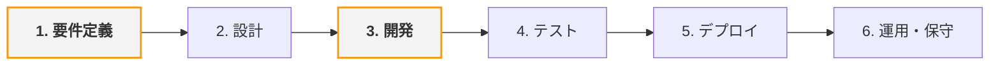
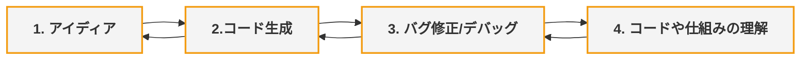

# 総合演習①


### 目次

[TOC]

---

## 4-1 限目: (15:40-16:25)

### 4 限出席コード

出席コードを slack に投稿します。

### 講義の目的

この講義では、生成AI（人工知能）活用方法の基本を再確認し、AIを用いた創作活動の可能性に改めて焦点を当てます。これまで学んだAI技術がクリエイティブな分野でどのように利用され、どのような影響を与えるかを再度理解し、実践的なスキルを再確認します。この講義を通じて、学生はAIを活用したWebアプリケーション開発手法を復習し、さらに実践力を強化します。最終的には、技術の進歩を活かして個人の創造性をさらに伸ばすための知識と技術を統合し、より深い理解と応用力を身につけます。

| 回数     |     1      |        2        |              **3**              |                    4                    |                    5                    | 6              | 7          | 8-14                         |
| -------- | :--------: | :-------------: | :-----------------------------: | :-------------------------------------: | :-------------------------------------: | -------------- | ---------- | ---------------------------- |
| テーマ   |  AI 基礎   | AI の活用と倫理 | プロンプトエンジニアリング:概要 | プロンプトエンジニアリング:アプリ生成 ① | プロンプトエンジニアリング:アプリ生成 ② | **総合演習 ①** | 総合演習 ② | フィジカルコンピューティング |
| 担当講師 | 小島、伊藤 |      小島       |              伊藤               |                  小島                   |                  伊藤                   | **小島**       | 伊藤、小島 | 白石先生                     |
| 開催方法 | オンサイト |    リモート     |            リモート             |                リモート                 |                リモート                 | **オンサイト** | オンサイト |                              |

### アイスブレイク (10 分)

> [!Note]
>
> 今日はいつ学校にきた?

```
:one: ~9:00AM
:two: 9:00AM~11:00AM
:three: 12:00AM~14:00PM
:four: 14:00PM~
```

> [!Note]
>
> 今週は学校に何回きた?

```
:one: 1回
:two: 2回
:three: 3回
:four: 4回
:five: 5回以上
```

> [!note]
>
> 

### 総合演習の進め方について (5分)

#### Day1 (今回の講義)

| 時間            | アクティビティ                                               |
| --------------- | ------------------------------------------------------------ |
| 4限目: (15:40-) | ・総復習<br />・補足(アイディエーションと計画作り、Webアプリケーション開発方法) |
| 5限目: (17:30-) | ・総合課題: アイディエーションと計画づくり ※学生フォロー<br />・中間発表: "Interim Presentation" |

#### Day2 (次回の講義)

| 時間            | アクティビティ                                       |
| --------------- | ---------------------------------------------------- |
| 4限目: (15:40-) | ・総合課題: Webアプリケーション開発<br />            |
| 5限目: (17:30-) | ・最終発表: "Demo Day" **※全員発表＆課題提出**<br /> |


### 総復習: AI基礎 (20 分)

#### AI(人工知能)とは

- AIは人間の知的行動をコンピューターで模倣する技術、またはその研究分野を指す。(参照: 第1回)
- AIは発展途上であり、歴史とともに人が想像するAIと現実のAIは変わってきている。(参照: 第1回)
- 歴史とともにAIを理解することが重要 (参照: 第1回)

#### 生成AIはどのように作られているか

- 機械学習はコンピューターとデータを使って規則性をみつける手法 (参照: 第1回)
- ニューラルネットワークは人間の脳神経系にヒントを得て、設計された計算モデル。その規模を大きくしたものがディープラーニング。(参照: 第1回)
- トランスフォーマーと自己教師により、現代の生成AIが実現できている。(参照: 第2回)


#### AIにはどのようなリスクがあるか

- AIが職業に与える影響の研究結果が報告されている。労働保管型と労働置換型があることを認識する。 (参照: 第2回)
- AIリスクは2階建て(1階: 合成性、2階: 社会受容性)　(参照: 第2回)
- AIにリスク(情報流出、著作権侵害、ハルシネーション等々)があることを理解して、臨機応変に使いこなそう　(参照: 第2回)


#### 生成AIの使い方


#### 生成活用のユースケース

##### ・「授業」のユースケース (参照: 第3回)

インプット: 英語の翻訳、資料の要約、画像の説明、深堀り
アウトプット: レポートのアイディア出し、レポートの生成、レポートの推敲、プレゼン資料の作成、プレゼン用画像の生成

##### ・「創作活動」のユースケース (参照: 第3回)

アイディア出し: 案だし、フィードバック、深堀り、アドバイス
ポートフォリオサイトの作成

##### ・「就職活動」のユースケース (参照: 第3回)

自己分析と計画: 自己分析、タスク化、キャリア相談

### 試行錯誤してみよう (15分)

> [!Note]
>
> **自分が納得がいくアイディア出してみよう **
>
> **テーマ: 卒業制作のアイディアを出してみよう**
>
> 例
>
> - アイディア出し: アイディアだしてもらおう
> - フィードバック: アイディアの良いところ、改善が必要なところをもらおう
> - 深堀り: 疑問に感じたことを質問し、理解することでアイディアを広げよう

> [!tip]
>
> 生成AIに役割を与えてみよう。
>
> (例) あなたは笑いで世界を幸せにするコメディアンです。
>
> 〇〇◯に関するアイディアを10個出してください。

> [!Tip]
>
> アイディアを広げるように指示してみよう
> ・そのアイディアを拡大したらどうなるか? 
> ・そのアイディアを代用したらどうか? 
> (参考:[オズボーンのチェックリスト](https://www.sbbit.jp/article/cont1/29988))

### 

## 4-2 限目: (16:35-17:20)

### 総復習: 生成AIを活用したWebアプリケーション開発

#### Webアプリケーションとは?

- Webアプリケーションは、インターネットを介してユーザーがアクセスできるアプリケーションソフトウェアのこと
- Webアプリケーションは一般的に3つの要素で構成される。クライアント、サーバー、データベース
- フロントエンドはHTML, CSS, JavaScriptバックエンドはJavaScript、Python等を使って実装される
- 本講義では主にフロントエンドを対象とし、AIを活用して創作活動を行う


#### codesandboxを活用したWebアプリケーション開発

- codesandboxでWebアプリケーションを開発できる
- 開発したアプリは即座に公開できる
- 様々な共有方法(URLリンク、ZIPファイルでの共有)

#### 様々なWebアプリケーション

- ポートフォリオサイト
- タイマーアプリ
- クイズアプリ
- 画像共有サイト
- シューティングゲーム

#### 一般的なソフトウェア開発プロセス

- **要件定義**：クライアントやプロジェクトの関係者からニーズを聞き、機能や仕様を明確にする
- **設計**: システムの全体像等（クライアント、サーバー、データベースなどの連携）を整理し、決定する
- **開発**: Webアプリケーション(フロントエンド、バックエンド、データベース)を実装する
- **テスト**: アプリケーションが正しく動作することを検証する
- **デプロイ**: サーバにアプリケーションを配置する。 
- **運用・保守**: アプリケーションが安定して稼働するように監視、修正、改善を行う



#### より複雑なWebアプリケーション開発

- (想像する)これらのソフトウェア開発



- 生成AIを活用した試行錯誤

  - デザイン変更

  - デバッグ

  - (認証)機能追加 

#### スマートホンのセンサーを活用したWebアプリケーション開発

- センサー

  - 加速度計
  - ジャイロスコープ
  - 方位磁石
  - 位置情報
  - ライトセンサー
  - マイク
  - 近接センサー

  - カメラ

- 通信機能

  - Wi-Fi
  - Bluetooth
  - セルラーネットワーク
  - NFC

#### ブラウザを活用したWebアプリケーション開発

- ローカルストレージ
- セッションストレージ
- クッキー
- 等々


> [!note]
>
> センサーを使ったWebアプリケーション開発を復習してみよう。
>
> 1. スマホをシェイクした数が表示されるWebページを作ってみよう (15分)
> 2. マイクから音を入力し、波形を出力するWebアプリケーションを作ってみよう (15分)


### 補足: アイディアの詳細化


## 5-1 限目: (17:30-)

### 5 限出席コード

出席コードを slack に投稿します。

### 総合演習課題

生成AIを活用して、アイディアを練り、計画をたててWebアプリケーションを開発してください。
以下のテーマの中で好きなものを選んでください。

**テーマ1: 推し紹介Webサイト**

**テーマ2: リアル連携ゲーム**


最終提出物: 

```
ドキュメント:
プロンプト履歴:
作成したWebアプリのコード:
CodeSandbox共有リンク
```


アイディエーションと計画

```
アイディア名:
そのアイディアにした理由:

計画:
必要な機能:

想定されるリスク:


```


## 5-2 限目: (18:25-)

