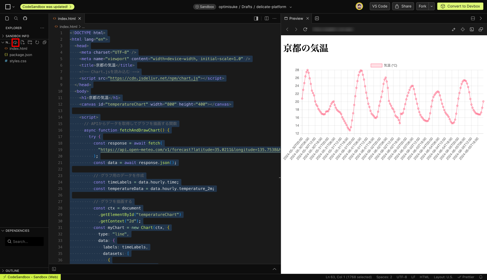

# 総合演習 ①


### 目次

[TOC]

---

## 4 限目: (15:40-17:20)

### 4 限出席コード

出席コードを slack に投稿します。

### 講義の目的

この講義では、生成 AI（人工知能）活用方法の基本を再確認し、AI を用いた創作活動の可能性に改めて焦点を当てます。これまで学んだ AI 技術がクリエイティブな分野でどのように利用され、どのような影響を与えるかを再度理解し、実践的なスキルを再確認します。この講義を通じて、学生は AI を活用した Web アプリケーション開発手法を復習し、さらに実践力を強化します。最終的には、技術の進歩を活かして個人の創造性をさらに伸ばすための知識と技術を統合し、より深い理解と応用力を身につけます。

| 回数     |     1      |        2        |                3                |                    4                    |                    5                    | 6          | **7**          | 8-14                         |
| -------- | :--------: | :-------------: | :-----------------------------: | :-------------------------------------: | :-------------------------------------: | ---------- | -------------- | ---------------------------- |
| テーマ   |  AI 基礎   | AI の活用と倫理 | プロンプトエンジニアリング:概要 | プロンプトエンジニアリング:アプリ生成 ① | プロンプトエンジニアリング:アプリ生成 ② | 総合演習 ① | **総合演習 ②** | フィジカルコンピューティング |
| 担当講師 | 小島、伊藤 |      小島       |              伊藤               |                  小島                   |                  伊藤                   | 小島       | **伊藤、小島** | 白石先生                     |
| 開催方法 | オンサイト |    リモート     |            リモート             |                リモート                 |                リモート                 | オンサイト | **オンサイト** |                              |

### アイスブレイク (10 分)

> [!Note]
>
> ケータイは何使ってる？

```
:one: iPhone
:two: Android
:three: その他
```

> [!note]
>
> レポートやドキュメントを書く時は何を使う？

```
:one: Microsoft ワード
:two: Google ドキュメント
:three: テキストファイル
:four: その他
```

> [!Note]
>
> 先週、この授業でた？

```
:one: でた
:two: でてない
```

> [!note]
>
> 外国に行ったことある？

```
:one: ある
:two: ない＆いきたい
:three: ない＆機会があれば
:four: ない＆いきたくない
```

### 総合演習の進め方について (5 分)

#### Day1 (前回の講義)

| 時間             | アクティビティ                                                                                   |
| ---------------- | ------------------------------------------------------------------------------------------------ |
| 4 限目: (15:40-) | ・総復習<br />・補足(アイディエーションと計画作り、Web アプリケーション開発方法)                 |
| 5 限目: (17:30-) | ・総合課題: アイディエーションと計画づくり ※学生フォロー<br />・中間発表: "Interim Presentation" |

#### Day2 (今回の講義)

| 時間             | アクティビティ                                       |
| ---------------- | ---------------------------------------------------- |
| 4 限目: (15:40-) | ・総合課題: Web アプリケーション開発<br />           |
| 5 限目: (17:30-) | ・最終発表: "Demo Day" **※全員発表＆課題提出**<br /> |

### 前回の振り返り (5 分)

[co-creation-with-genai/2024/6_comprehensive_exercise at main · Creative-Cucumbers/co-creation-with-genai](https://github.com/Creative-Cucumbers/co-creation-with-genai/tree/main/2024/6_comprehensive_exercise)

[co-creation-with-genai/2024/6_comprehensive_exercise/NAME_GENAI_REPORT.md at main · Creative-Cucumbers/co-creation-with-genai](https://github.com/Creative-Cucumbers/co-creation-with-genai/blob/main/2024/6_comprehensive_exercise/NAME_GENAI_REPORT.md)

### 最終提出物・発表の確認 (10 分)

#### 提出物

- ドキュメント
  - アイディアと計画 (前回の記載したテキストファイル)
  - Web アプリケーション (前回記載したものに追記)
- 作成した Web アプリのコード (CodeSandbox から ZIP ファイルでダウンロードできます)
- 画面キャプチャ（可能な方は動画も）

#### CodeSandbox コードのダウンロード方法

画面左側のダウンロードボタンをクリックします。



#### ドキュメント

以下のリンクの内容を記載ください。

[co-creation-with-genai/2024/7_comprehensive_exercis2/NAME_GENAI_REPORT2.md at main · Creative-Cucumbers/co-creation-with-genai](https://github.com/Creative-Cucumbers/co-creation-with-genai/blob/main/2024/7_comprehensive_exercis2/NAME_GENAI_REPORT2.md)

#### 提出方法

Google Classroom にて提出ください。

#### 提出期限

2024/6/7 (金)

※ 期限を過ぎると提出できなくなります。
※ 未完成でも提出ください。

#### 発表

- 実際の画面をデモしてもらいます
- ドキュメントに記載したポイントも共有ください
- パワーポイント等のスライドは不要です
- 積極的に質問してください

#### 発表の注意点

機能を少しずつ追加する等して、一部でも良いので「動く」状態をキープしながら細かくアップデートすることをおすすめします。

限られた時間ですので、最後まで完成しないことを見越して、動いているバージョンを保存しながら、進めてください。

（例：以下のような順番でコードをダウンロードしてバージョン管理しながら、進める）

1. 画面表示まで実装
2. 文字を修正
3. 見た目を修正（← 進捗がここまでであれば、ここで発表）
4. 動きをつける

## 5 限目: (17:30-19:10)

※ 開始時間は、参加者数によって前後します。

### 5 限出席コード

出席コードを slack に投稿します。

### 発表 (10 分/人)

### まとめ
